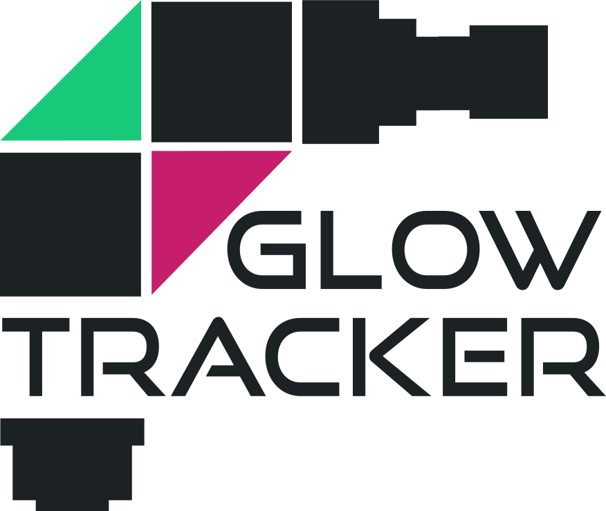

# GlowTracker

<div style="display: flex; justify-content: center; align-items: center;">
    <table style="width: 80%; border: none;">
        <colgroup>
            <col style="width: 30%;">
        </colgroup>
        <tr>
            <td>
                
            </td>
            <td style="text-align: left; vertical-align: top;">   
                GlowTracker is a microscope tracking application that has the capability of tracking a small animal in bright-field, single or dual epi-fluorescence imaging. The application interface provides controls over linear Zaber stage movement and Basler camera properties. Please visit the documentation website on how to build the setup from scratch and how to operate the software at <a href="https://scholz-lab.github.io/GlowTracker/">https://scholz-lab.github.io/GlowTracker/</a>.
            </td>
        </tr>
    </table>
</div>

## Getting started
### Software Setup
1. Create a Python environment using **uv** (recommend) or **venv**.
    - Using **uv** (Recommend)
        1. Install uv [[Link]](https://docs.astral.sh/uv/getting-started/installation/).
        2. Create a virtual environment
            ```bash
            uv venv glowtracker.venv
            ```
    - Using **venv**
        1. Create the environment
            ```bash
            python -m venv glowtracker.venv
            ```

2. Activate the environment
    ```bash
    source glowtracker.venv/Scripts/activate
    ```

3. Install GlowTracker
    You can choose to either install GlowTracker from a distributed Python package from PyPI or clone the git repository and run them locally.

    - Using `pip` to install from PyPI repository:
        ```bash
        uv pip install glowtracker
        ```
    - Or clone and run the package locally.
        1. Clone the pository
            ```bash
            git clone https://github.com/scholz-lab/GlowTracker.git
            ```
        2. Update the conda environment to download the dependencies
            ```bash
            cd Glowtracker;
            uv pip install -r pyproject.toml;
            ```


4. Install the **BASLER** pylon software and runtime library [[Link]](https://www.baslerweb.com/en/software/pylon/)
    - pylon Camera Software Suite
    - pylon runtime library

5. (Optional) Install **Zaber Launcher** for inspecting and updating stage firmware [[Link]](https://software.zaber.com/zaber-launcher/download)

6. After finished installation, the software can be started in several ways
    - If you have installed it via pip
        ```bash
        python -m glowtracker
        ```
        or simply
        ```bash
        glowtracker
        ```
    - If you have installed it by cloning the package and running them locally
        ```bash
        python glowtracker/__main__.py
        ```

### Device Setup
#### Stage
In **Settings > Stage > Stage serial port**, specify the connection port name to your Stage. In Windows, this is usually `port = COM3`. And `/dev/ttyUSB0` for Linux.

#### Camera
In **Settings > Camera > Default camera settings**, specify the path to your pylon default camera setting. This is a `.pfs` file that can be obtained from the [pylon Viewer](https://www.baslerweb.com/en/software/pylon/pylon-viewer/) software that you have downloaded.

## GUI overview


## Code overview

The application is based on the Kivy framework which connects to the microscope hardware.
The GUI functionality is implemented mostly in the Kivy file, whereas device functionality is relayed to specific modules.

## Known issues

- On Linux systems, accessing serial ports needs to be allowed for the user running the GUI. In Ubuntu and similar systems, the user has to be added to the group 'dialout'.

## Supported Operating Systems
- Windows 10, Windows 11
- Ubuntu 16.04 or newer
- macOS Sonoma or newer
