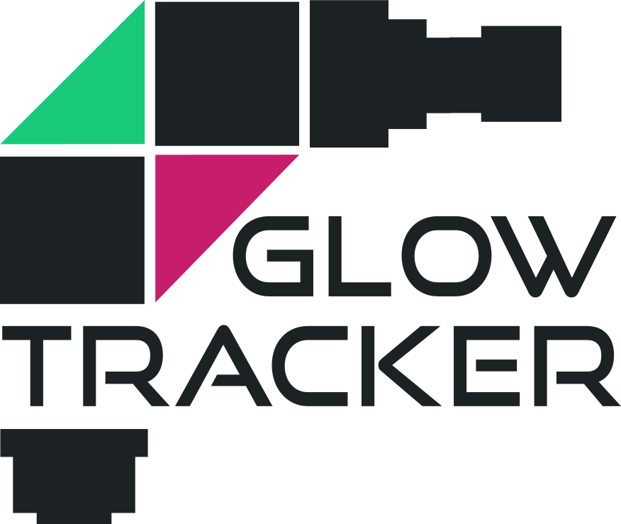
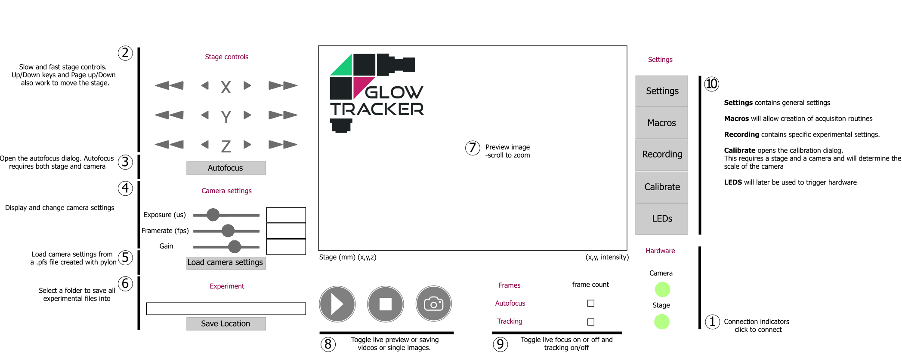

# GlowTracker

<div style="display: flex; justify-content: center; align-items: center;">
    <table style="width: 80%; border: none;">
        <colgroup>
            <col style="width: 30%;">
        </colgroup>
        <tr>
            <td>
                
            </td>
            <td style="text-align: left; vertical-align: top;">   
                GlowTracker is a macroscope tracking application that has the capability of tracking a small animal in bright field, single or dual epi-fluorescence imaging. The application interface provides controls over linear Zaber stage movement and Basler camera properties. Please visit the documentation website on how to build the setup from scratch and how to operate the software at <a href="https://scholz-lab.github.io/GlowTracker/">https://scholz-lab.github.io/GlowTracker/</a>.
            </td>
        </tr>
    </table>
</div>


## Getting started
### Install the correct environment
1. Install **Conda** [[Link]](https://conda.io/projects/conda/en/latest/user-guide/install/index.html)
2. Create environment
    - Using **Mamba** (faster, recommended)
        1. Install Mamba from [[Link]](https://mamba.readthedocs.io/en/latest/installation.html)
        2. Create environment: 
            ```bash 
            mamba env update -n macroscope --file StageEnvironment.yml
            ```
    - Using **Conda**
        ```bash 
        conda env create --file StageEnvironment.yml
        ```

3. Activate the environment: 
    ```bash
    conda activate macroscope
    ```

4. Install the **BASLER** pylon software and runtime library [[Link]](https://www.baslerweb.com/en/software/pylon/)
    - pylon Camera Software Suite
    - pylon runtime library

5. (Optional) Install **Zaber Launcher** for inspecting and updating stage firmware [[Link]](https://software.zaber.com/zaber-launcher/download)

6. After finished installing, the software can be started by
    ```bash
    python GlowTracker.py
    ```

### Device Setup
#### Stage
In `macroscope.ini`, specify the connection `port` name to your Stage. In Windows, this is usually `port = COM3`. In Linux, usually `port = /dev/ttyUSB0`

#### Camera
In `macroscope.ini`, specify path to your pylon default camera setting `default_settings`. This is a `.pfs` file that can be obtain from the `pylon Viewver` software that you have downloaded.

## GUI overview


## Code overview

The application is based on Kivy framework which connects to the macroscope hardware.
The GUI functionality is implemented mostly in the kivy file, whereas device functionality is relayed to specific modules.

## Known issues

- On Linux systems, accessing serial ports needs to be allowed for the user running the GUI. In Ubuntu and similar systems the user has to be added to the group 'dialout'.
