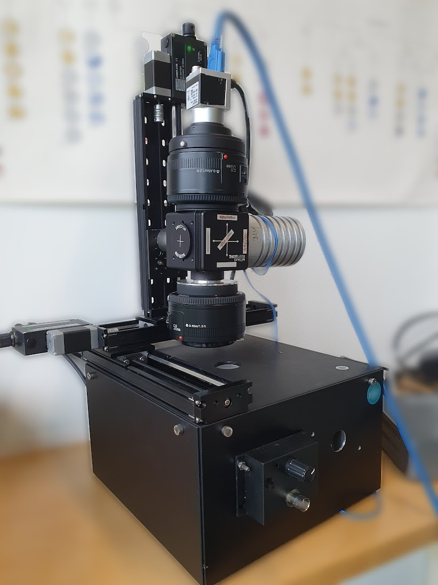
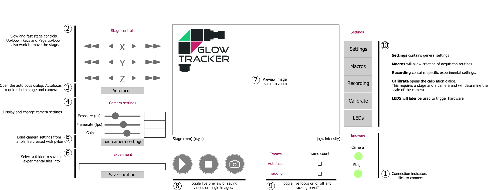

# Macroscope

Documentation and scripts to control the behavior macroscope. The behavior macroscope is a single magnification microscope with capabilities for epi-fluorescence and brightfield imaging. Addition of a pinhole allows for holographic imaging too.

The macroscope GUI is intened to provide a tracking interface for manual and automated tracking. Limited access to camera parameters is provided, but we assume users will use the pylon software from Basler to adjust and save complex configurations as we do not wish to duplicate this work.

 

---

## Getting started
### Install the correct environment
1. Install conda from https://conda.io/projects/conda/en/latest/user-guide/install/index.html
2. Create environment
    - Using Conda
        1. Create environment: `conda env create --file .\StageEnvironment.yml`
    - Using Mamba (faster, recommended)
        1. Install mamba from https://mamba.readthedocs.io/en/latest/installation.html
        2. Create environment: `mamba env update -n macroscope --file .\StageEnvironment.yml`

3. Activate the environment: `conda activate macroscope`

4. Install the BASLER package
   To get the BASLER package running on windows 64 do the following:
    1. Install pylon (software from BASLER) including all interfaces
    2. Get the pypylon package from GitHub: https://github.com/basler/pypylon
    3. Use pip to install the package using the proper wheel (in my case pypylon-1.5.4-cp37-cp37m-win_amd64.whl)
    4. Run this using the comandline within the package folder: `pip install pypylon-1.5.4-cp37-cp37m-win_amd64.whl`

### Device Setup
#### Stage
In `macroscope.ini`, specify the connection `port` name to your Stage. In Windows, this is usually `port = COM3`. In Linux, usually `port = /dev/ttyUSB0`

#### Camera
In `macroscope.ini`, specify path to your pylon default camera setting `default_settings`. This is a `.pfs` file that can be obtain from the `pylon Viewver` software that you have downloaded.

---

## GUI overview

## Code overview

The GUI is build as a kivy App which connects to the macroscope hardware (currently two USB devices).
GUI functionality is implemented mostly in the kivy file, whereas device functionality is relayed to specific modules. 

## Known issues
-  While the exposed camera parameters can be changed during live preview, the framerate is fixed to a display framerate. This might be undesired behavior.

To get controls for zaber stage running:

- install zaber motion package by running one of the following lines (python version must be 3.5 or higher to use Zaber library):
     
       conda install -c conda-forge zaber-motion
       conda install -c conda-forge/label/cf202003 zaber-motion
       
- See SimpleStageExample.py for two alternative approaches to begin the communication with the satge.
- The SDK to control the stage has two different levels of code. One is the ASCII lib, which is used to communicate to the stage on a lower level:
https://www.zaber.com/support/docs/api/core-python/0.8.1/ascii.html#
Then we have the API written for python, which uses the ASCII lib under the hood to execute the commands:
https://www.zaber.com/software/docs/motion-library/ascii/references/python/#axis
        
- It is advisable to include lines homing your device at the beginning of your code to find its reference position to perform meaningful absolute position movements!      

- on Linux systems, accessing serial ports needs to be allowed for the user running the GUI. In Ubuntu and similar systems the user has to be added to the group 'dialout'.
