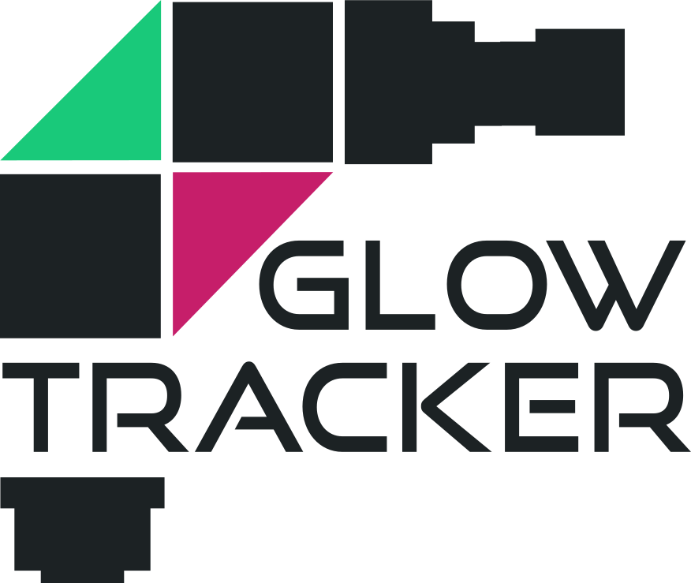
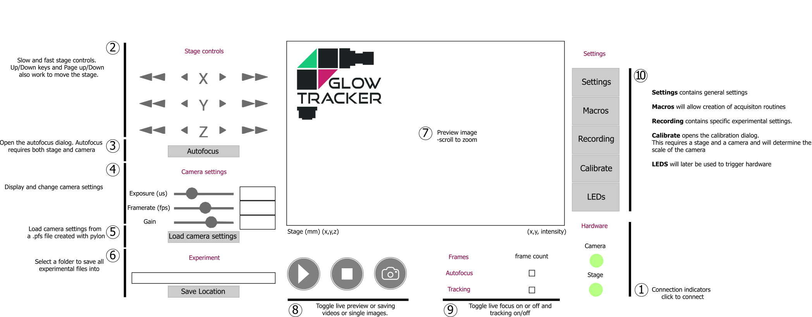

# GlowTracker

<div style="display: flex; justify-content: center; align-items: center;">
    <table style="width: 80%; border: none;">
        <colgroup>
            <col style="width: 30%;">
        </colgroup>
        <tr>
            <td>
                
            </td>
            <td style="text-align: left; vertical-align: top;">   
                GlowTracker is a microscope tracking application that has the capability of tracking a small animal in bright-field, single or dual epi-fluorescence imaging. The application interface provides controls over linear Zaber stage movement and Basler camera properties. Please visit the documentation website on how to build the setup from scratch and how to operate the software at <a href="https://scholz-lab.github.io/GlowTracker/">https://scholz-lab.github.io/GlowTracker/</a>.
            </td>
        </tr>
    </table>
</div>

## Getting started
### Software Setup
GlowTracker supports Python 3.11 through 3.13. Python 3.12 is the recommended version.

1. Install [uv](https://docs.astral.sh/uv/getting-started/installation/).

2. Install GlowTracker from PyPI:

    ```bash
    uv venv --python 3.12
    uv pip install glowtracker
    ```

    Or install a development checkout using the locked dependencies:

    ```bash
    git clone https://github.com/scholz-lab/GlowTracker.git
    cd GlowTracker
    uv sync --extra test
    uv run pytest -q
    ```

3. Install the **BASLER** pylon software and runtime library [[Link]](https://www.baslerweb.com/en/software/pylon/)
    - pylon Camera Software Suite
    - pylon runtime library

4. (Optional) Install **Zaber Launcher** for inspecting and updating stage firmware [[Link]](https://software.zaber.com/zaber-launcher/download)

5. Start the application.

    - From an activated environment:

        ```bash
        python -m glowtracker
        ```

        or:

        ```bash
        glowtracker
        ```

    - From a development checkout without activating the environment:

        ```bash
        uv run glowtracker
        ```

### Comparing scan modes

In the plate setup dialog, choose **Scan mode → Sequential** (the default) or
**Continuous**, then add/update the plate or save its preset. The mode is saved
per plate; older presets use Sequential.

Sequential stops at each tile. Continuous captures while moving along each row
of the same search path, then stops to confirm and center a candidate before
tracking. Both modes use the same initial Z search, exposure, gain, detection
threshold, search limit, and pass count. Continuous capture runs at the rate the
exposure and camera allow; it does not force 60 fps. Set movement speed under
**Settings → Stage → Scan speed** and row spacing with the scan overlap settings.

To compare, run the same plate and settings in each mode. The console reports
sequential timing per tile and continuous search time, frames processed, and rows
visited. Continuous mode rechecks recent stage positions after a moving detection;
these positions are approximate, so blur or passing an animal between usable
frames can still cause missed detections. Test detection reliability on the
microscope at your chosen speed and exposure.

### Device Setup
#### Stage
In **Settings > Stage > Stage serial port**, specify the connection port name to your Stage. In Windows, this is usually `port = COM3`. And `/dev/ttyUSB0` for Linux.

#### Camera
In **Settings > Camera > Default camera settings**, specify the path to your pylon default camera setting. This is a `.pfs` file that can be obtained from the [pylon Viewer](https://www.baslerweb.com/en/software/pylon/pylon-viewer/) software that you have downloaded.

## GUI overview


## Code overview

The application is based on the Kivy framework which connects to the microscope hardware.
The GUI functionality is implemented mostly in the Kivy file, whereas device functionality is relayed to specific modules.

## Known issues

- On Linux systems, accessing serial ports needs to be allowed for the user running the GUI. In Ubuntu and similar systems, the user has to be added to the group 'dialout'.

## Supported Operating Systems
- Windows 10, Windows 11
- Ubuntu 16.04 or newer
- macOS Sonoma or newer
