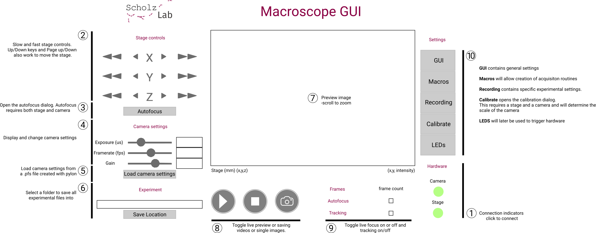

# GlowTracker

<div style="display: flex; justify-content: center; align-items: center;">
    <table style="width: 80%; border: none;">
        <colgroup>
            <col style="width: 30%;">
        </colgroup>
        <tr>
            <td>
                
            </td>
            <td style="text-align: left; vertical-align: top;">   
                GlowTracker is a macroscope tracking application that has the capability of tracking a small animal in bright-field, single or dual epi-fluorescence imaging. The application interface provides controls over linear Zaber stage movement and Basler camera properties. Please visit the documentation website on how to build the setup from scratch and how to operate the software at <a href="https://scholz-lab.github.io/GlowTracker/">https://scholz-lab.github.io/GlowTracker/</a>.
            </td>
        </tr>
    </table>
</div>

## Getting started
### Software Setup
1. Install **Conda** [[Link]](https://conda.io/projects/conda/en/latest/user-guide/install/index.html)
2. Use `conda` to create a new python environment named `macroscope`.
    ```bash
    conda create -n macroscope 'python>=3.9,<3.12'
    ```

3. Activate the `macroscope` environment and install the `glowtracker` app using `pip`: 
    ```bash
    conda activate macroscope
    python -m pip install glowtracker
    ```

4. Install the **BASLER** pylon software and runtime library [[Link]](https://www.baslerweb.com/en/software/pylon/)
    - pylon Camera Software Suite
    - pylon runtime library

5. (Optional) Install **Zaber Launcher** for inspecting and updating stage firmware [[Link]](https://software.zaber.com/zaber-launcher/download)

6. After finished installation, the software can be started by
    ```bash
    python glowtracker/__main__.py
    ```

### Device Setup
#### Stage
In `macroscope.ini`, specify the connection `port` name to your Stage. In Windows, this is usually `port = COM3`. In Linux, usually `port = /dev/ttyUSB0`

#### Camera
In `macroscope.ini`, specify the path to your pylon default camera setting `default_settings`. This is a `.pfs` file that can be obtained from the `pylon Viewer` software that you have downloaded.

## GUI overview


## Code overview

The application is based on the Kivy framework which connects to the macroscope hardware.
The GUI functionality is implemented mostly in the Kivy file, whereas device functionality is relayed to specific modules.

## Known issues

- On Linux systems, accessing serial ports needs to be allowed for the user running the GUI. In Ubuntu and similar systems, the user has to be added to the group 'dialout'.
