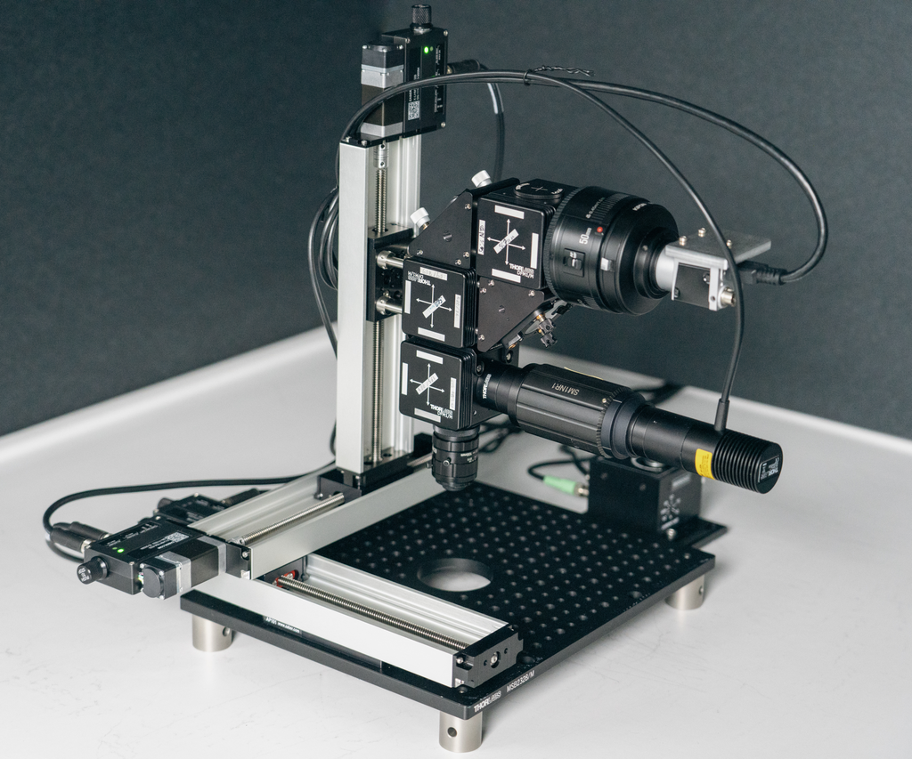

# Build your own GlowTracker

<table class="equal-column-table">
      <tr>
        <td>
          <figure class="center-figure">
            
          </figure>
        </td>
        <td>
          <figure class="center-figure">
            
          </figure>
        </td>
      </tr>
    </table>

## Steps for assembling your microscope
Assuming you have all the parts from the parts list [TODO: link] handy, the assembly should take about 2 h to go from parts to fully functional microscope. 

1. [Stage and base](#stage-base)
2. [Lightpath](#lightpath)
3. [Filters](#filters)
4. [Adjust field-of-view for dual color imaging ](#dual-color-fov) 
5. [Dual-color calibration (optional).](#dual-color-calibration) 
6. [Install the software](#install-software) 

### Tools
You should have a metric Thorlabs Balldriver & Hex Key Kits, and an SM1 spanner wrench handy. A tiny flat head screwriver is useful for adjusting the camera orientation.

## Stage and base 
<table class="equal-column-table">
      <tr>
        <td>
          <figure class="center-figure">
            
            <figcaption>Find these parts. They are required for stage assembly.</figcaption>
          </figure>
        </td>
        <td>
          <figure class="center-figure">
            
            <figcaption>This is the result after successful stage assembly.</figcaption>
          </figure>
        </td>
      </tr>
    </table>
  
### Building the frame
<table class="equal-column-table">
      <tr>
        <td>
          <figure class="center-figure">
            
            <figcaption>1. Screw the four small posts into the bottom of the breadboard.</figcaption>
          </figure>
        </td>
        <td>
          <figure class="center-figure">
            
            <figcaption>2. Fix the base plate to the breadboard using M6 screws.</figcaption>
          </figure>
        </td>
        <td>
          <figure class="center-figure">
            
            <figcaption>3. Connect the stage to power using the power cable. </figcaption>
          </figure>
        </td>
            <td>
          <figure class="center-figure">
            
            <figcaption>4. Use the knob to move the stage and expose the screw holes.</figcaption>
          </figure>
        </td>
      </tr>
      <tr>
        <td>
          <figure class="center-figure">
            
            <figcaption>5. Add first stage axis by screwing into holder.</figcaption>
          </figure>
        </td>
        <td>
          <figure class="center-figure">
            
            <figcaption>6. Add the second stage axis by screwing it into the carriage of the first axis.</figcaption>
          </figure>
        </td>
        <td>
          <figure class="center-figure">
            
            <figcaption>7. Add the final stage (vertical) by fixing the bottom end to the carriage of the second axis.</figcaption>
          </figure>
        </td> 
        <td>
          <figure class="center-figure">
            
            <figcaption>8.Fix the black adapter plate to the carriage of the vertical stage.</figcaption>
          </figure>
        </td> 
      </tr>  
    </table>

### Daisy-chaining the stage
<table class="equal-column-table">
  <tr>
    <td>
      <figure class="center-figure">
        
        <figcaption>1. Daisy chain the stages by connecting the port labelled 'next' of the first axis to the 'prev' port of the second axis.</figcaption>
      </figure>
    </td>
    <td>
      <figure class="center-figure">
        
        <figcaption>2. Connect the 'next' port of axis 2 to 'prev' of axis 3. All stages should light up green when the first is connected to the power source.</figcaption>
      </figure>
    </td>
      <td>
      <figure class="center-figure">
        
        <figcaption>3. Connect the first axis to the USB cable by plugging it into the port labelled 'prev'.</figcaption>
      </figure>
    </td>
    <td>
      <figure class="center-figure">
        
        <figcaption>4.  All stages should light up green when the first is connected to the power source.</figcaption>
      </figure>
    </td>
  </tr>
</table>

