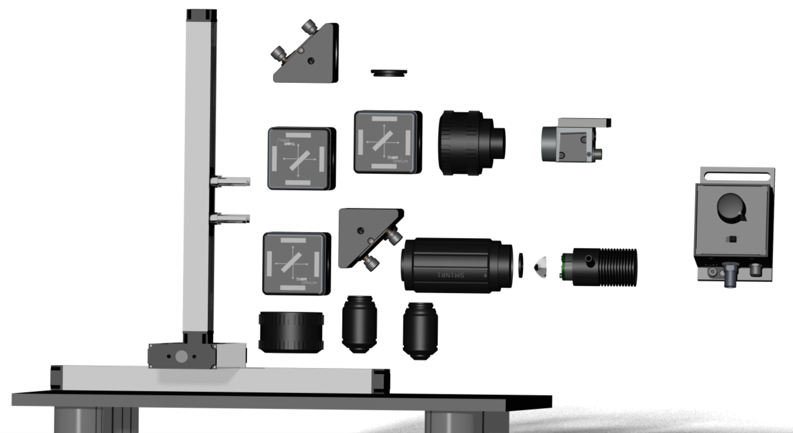

# Build your own GlowTracker

    
    

<table class="equal-column-table">
      <tr>
        <td>
          <figure class="center-figure">
            
            <figcaption>Fluorescent drop on a slide</figcaption>
          </figure>
        </td>
        <td>
          <figure class="center-figure">
            
            <figcaption>Placing the slide on the center of objective</figcaption>
          </figure>
        </td>
      </tr>
    </table>

## Steps for assembling your microscope
Assuming you have all the parts from the parts list [TODO: link] handy, the assembly should take about 1h to go from parts to fully functional micrsocope.

1. [Stage and base](#stage-base)
2. [Lightpath](#lightpath)
3. [Filters](#filters)
4. [Adjust field-of-view for dual color imaging ](#dual-color-fov) 
5. [Dual-color calibration (optional).](#dual-color-calibration) 
6. [Install the software](#install-software) 

## Stage and base 
<table class="equal-column-table">
      <tr>
        <td>
          <figure class="center-figure">
            
            <figcaption>Fluorescent drop on a slide</figcaption>
          </figure>
        </td>
        <td>
          <figure class="center-figure">
            
            <figcaption>Placing the slide on the center of objective</figcaption>
          </figure>
        </td>
      </tr>
    </table>
- collect the parts for the stage 

## Lightpath 

## Adjust field-of-view for dual color imaging 

## Install the software 
