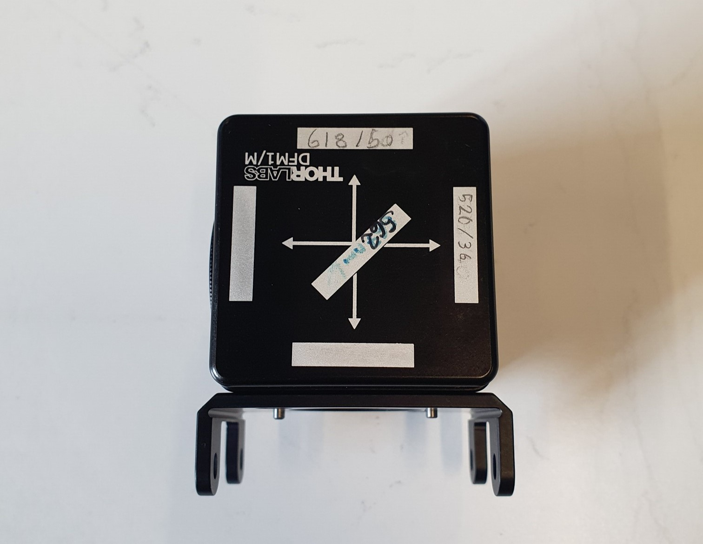
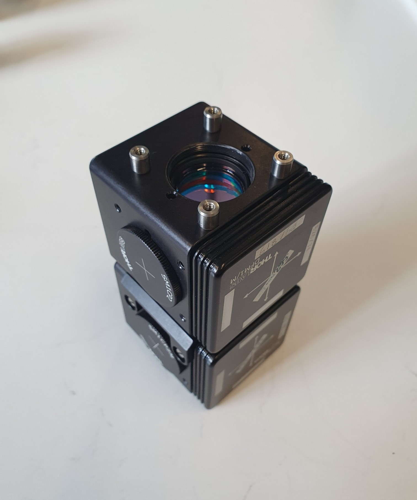
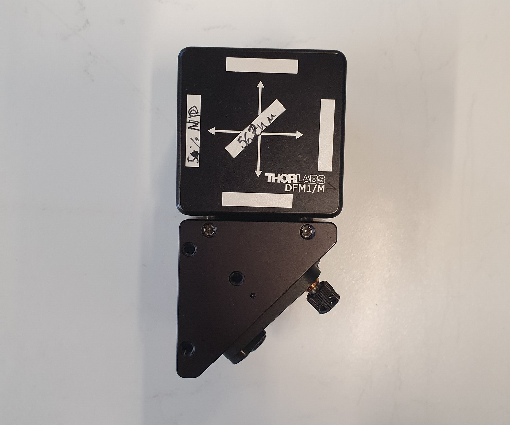
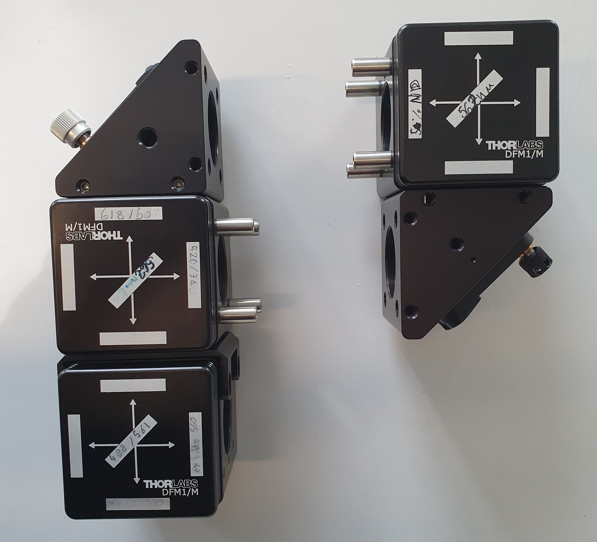
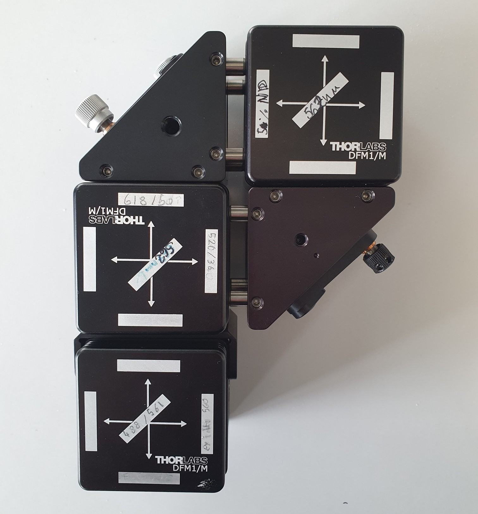
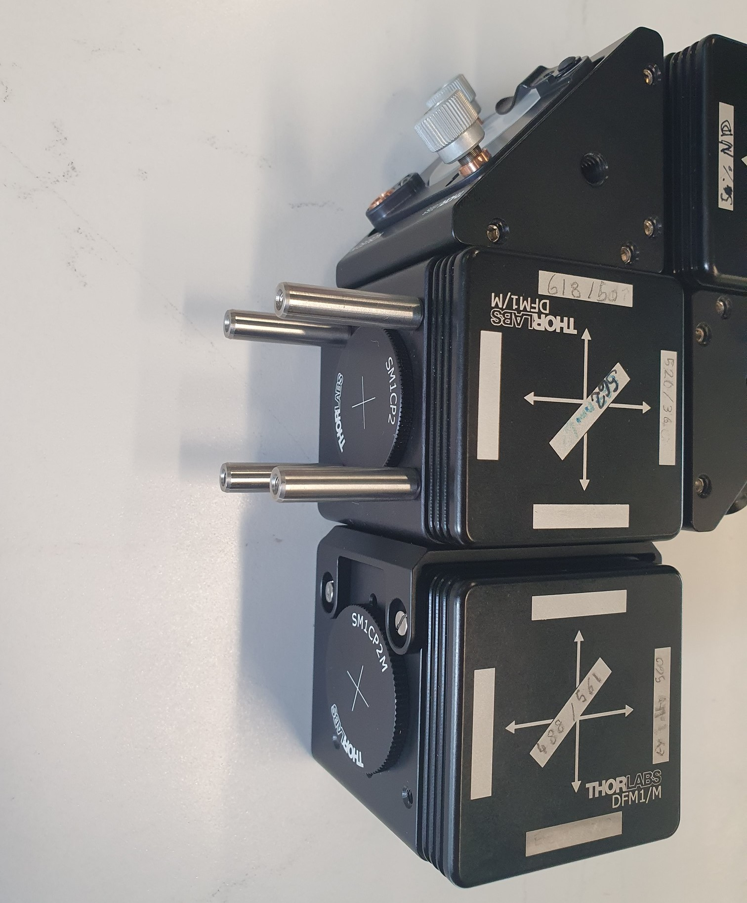
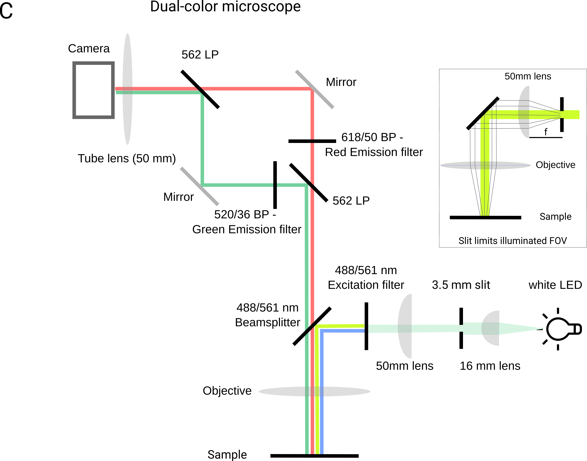

# Build your own GlowTracker

<table class="equal-column-table">
      <tr>
        <td>
          <figure class="center-figure">
            
          </figure>
        </td>
        <td>
          <figure class="center-figure">
            
          </figure>
        </td>
      </tr>
    </table>

## Steps for assembling your macroscope 

Assuming you have all the parts from the <a href="https://scholz-lab.github.io/GlowTracker/List%20of%20parts/List_of_parts.html"><i>parts list</i></a> available, you should be able to assemble the macroscope in about two hours and have a fully functional tool.

1. [Stage and base](#stage-base)
2. [Lightpath](#lightpath)
3. [Filters](#filters)
4. [Adjust field-of-view for dual color imaging ](#dualview-alignment) 
5. [Dual-color calibration (optional).](#dual-color-calibration) 
6. [Install the software](#install-software) 

### Tools
You should have a metric Thorlabs Balldriver & Hex Key Kits, and an SM1 spanner wrench handy. A tiny flat-head screwdriver is useful for adjusting the camera orientation.

## Stage and base 
<table class="equal-column-table">
      <tr>
        <td>
          <figure class="center-figure">
            
            <figcaption>Find these parts. They are required for stage assembly.</figcaption>
          </figure>
        </td>
        <td>
          <figure class="center-figure">
            
            <figcaption>This is the result after successful stage assembly.</figcaption>
          </figure>
        </td>
      </tr>
    </table>
  
### Building the frame
<table class="equal-column-table">
      <tr>
        <td>
          <figure class="center-figure">
            
            <figcaption>1. Screw the four small posts into the bottom of the breadboard.</figcaption>
          </figure>
        </td>
        <td>
          <figure class="center-figure">
            
            <figcaption>2. Fix the base plate to the breadboard using M6 screws.</figcaption>
          </figure>
        </td>
        <td>
          <figure class="center-figure">
            
            <figcaption>3. Connect the stage to power using the power cable. </figcaption>
          </figure>
        </td>
            <td>
          <figure class="center-figure">
            
            <figcaption>4. Use the knob to move the stage and expose the screw holes.</figcaption>
          </figure>
        </td>
      </tr>
      <tr>
        <td>
          <figure class="center-figure">
            
            <figcaption>5. Add the first stage axis by screwing it into the holder.</figcaption>
          </figure>
        </td>
        <td>
          <figure class="center-figure">
            
            <figcaption>6. Add the second stage axis by screwing it into the carriage of the first axis.</figcaption>
          </figure>
        </td>
        <td>
          <figure class="center-figure">
            
            <figcaption>7. Add the final stage (vertical) by fixing the bottom end to the carriage of the second axis.</figcaption>
          </figure>
        </td> 
        <td>
          <figure class="center-figure">
            
            <figcaption>8.Fix the black adapter plate to the carriage of the vertical stage.</figcaption>
          </figure>
        </td> 
      </tr>  
    </table>

### Daisy-chaining the stage
<table class="equal-column-table">
      <tr>
        <td>
          <figure class="center-figure">
            
            <figcaption>1. Daisy chains the stages by connecting the port labeled 'next' of the first axis to the 'prev' port of the second axis.</figcaption>
          </figure>
        </td>
        <td>
          <figure class="center-figure">
            
            <figcaption>2. Connect the 'next' port of axis 2 to 'prev' of axis 3. All stages should light up green when the first is connected to the power source.</figcaption>
          </figure>
        </td>
        <td>
          <figure class="center-figure">
            
            <figcaption>3. Connect the first axis to the USB cable by plugging it into the port labeled 'prev'.</figcaption>
          </figure>
        </td>
        <td>
          <figure class="center-figure">
            
            <figcaption>4.  All stages should light up green when the first is connected to the power source.</figcaption>
          </figure>
        </td>
      </tr>
    </table>

## Lightpath - hardware only 

### Hardware 

  In this section, you will add the lightpath to the stages. We will first assemble the structure and add the filters and dichroics in the next step.

  <i><b>Note:</b> If you order the lenses we suggest, they come pre-mounted. However, in case you are using lenses you already have you need to mount them in a short (10 mm) lens tube using a retaining ring. Refer to the lightpath diagram and the photos for correct lens orientation.</i>

<table class="equal-column-table">
      <tr>
        <td>
          <figure class="center-figure">
             
            <figcaption>Find these parts. You can lay out the filters on optical paper. Dichroics are <b>not</b> labeled - so be sure not to switch them!</figcaption>
          </figure>
        </td>
        <td>
          <figure class="center-figure">
            
            <figcaption>When you finish this section you should have the macroscope without filters fully assembled.</figcaption>
          </figure>
        </td>
      </tr>
    </table>

### LED assembly
In this section, we assemble the white light LED. The optics are used to collimate the light and focus a slit onto the focal plane of the sample, restricting illumination to a small area. This will allow us to later separate the two colors onto the camera chip.
  <table class="equal-column-table">
    <tr>
      <td>
        <figure class="center-figure">
          
          <figcaption>1. Start with the white LED.</figcaption>
        </figure>
      </td>
      <td>
        <figure class="center-figure">
          
          <figcaption>2. Add a lens tube for spacing.</figcaption>
        </figure>
      </td>
      <td>
        <figure class="center-figure">
          
          <figcaption>3. Add the 16 mm focal length lens. </figcaption>
        </figure>
      </td>
          <td>
        <figure class="center-figure">
          
          <figcaption>4. Secure the lens with a retaining ring. </figcaption>
        </figure>
      </td>
    </tr>
    <tr>
      <td>
        <figure class="center-figure">
          
          <figcaption>5. Add another lens tube as a spacer.</figcaption>
        </figure>
      </td>
      <td>
        <figure class="center-figure">
          
          <figcaption>6. Identify the slit and the adjustable element (thicker black tube).</figcaption>
        </figure>
      </td>
      <td>
        <figure class="center-figure">
          
          <figcaption>7. Secure the slit inside the adjustable element using a retaining ring.</figcaption>
        </figure>
      </td> 
      <td>
        <figure class="center-figure">
          
          <figcaption>8. Screw the adjustable element into the lens tube from step 5.</figcaption>
        </figure>
      </td> 
    </tr>
     <tr>
      <td>
        <figure class="center-figure">
          
          <figcaption>9. Add a short lens tube as a spacer.</figcaption>
        </figure>
      </td>
      <td>
        <figure class="center-figure">
          
          <figcaption>10. Add the 50mm focal length lens. </figcaption>
        </figure>
      </td>
      <td>
        <figure class="center-figure">
          
          <figcaption>11. The final assemble should look like this.</figcaption>
        </figure>
      </td> 
    </tr>  
  </table>

### Image-splitter assembly

  The image splitter is the heart of the macroscope. Mechanics matter as a crooked assembly will lead to issues with the image quality. Before starting, lay out all the parts required. Pay attention to the cube orientations and follow the pictures exactly. 

<table class="equal-column-table">
    <tr>
      <td>
        <figure class="center-figure">
          
          <figcaption>1. Identify one of the 3 DFM1 cubes and attach the cage cube adapter.</figcaption>
        </figure>
      </td>
      <td>
        <figure class="center-figure">
          
          <figcaption>2. Cube after adding connector. Note <b>orientation</b>!</figcaption>
        </figure>
      </td>
      <td>
        <figure class="center-figure">
          
          <figcaption>3. Connect another DFM1 cube by using the black screws from the connector pack. </figcaption>
        </figure>
      </td>
    </tr>
    <tr>
      <td>
        <figure class="center-figure">
          
          <figcaption>4. Close the left holes with two SM1CP2 caps and screw in 4 ER025 cage assembly rods into the top cube. </figcaption>
        </figure>
      </td>
      <td>
        <figure class="center-figure">
          
          <figcaption>5. Connect the triangular mirror using the set screws. Remove the tiny screws from the ends of the ER025 rods so they fit fully into the holes of the mirror.</figcaption>
        </figure>
      </td>
      <td>
        <figure class="center-figure">
          
          <figcaption>6. Screw 4 ER05 rods into the right side of the middle cube, again removing the set screws on the other side.</figcaption>
        </figure>
      </td>
       </tr>
    <tr>
      <td>
        <figure class="center-figure">
          
          <figcaption>7. Grab the third DFM1 cube and screw 4 ER025 rods into the bottom. </figcaption>
        </figure>
      </td> 
      <td>
        <figure class="center-figure">
          
          <figcaption>8. Secure to the triangular mirror using set screws. Ensure the mirror is securely attached and not crooked.</figcaption>
        </figure>
      </td> 
      <td>
        <figure class="center-figure">
          
          <figcaption>9. Add 4 ER05 rods to the cube-mirror from 8. such that the two halves of the image splitter look as shown.</figcaption>
        </figure>
      </td>
    </tr>  
     <tr>
      <td>
        <figure class="center-figure">
          
          <figcaption>10. Loosen the set screws in the mirrors and slide the halves together. Tighten the set screws to secure the halves. If all parts are assembled straight, this should not require force!</figcaption>
        </figure>
      </td>
      <td>
        <figure class="center-figure">
          
          <figcaption>11. Add 4 ER rods to the closed-off side of the image splitter for mounting to the stage. </figcaption>
        </figure>
      </td>
      <td>
        <figure class="center-figure">
          
          <figcaption>12. Connect the Basler camera to the Yongnuo objective using the Kipon adapter. </figcaption>
        </figure>
      </td>
    </tr>  
  </table>

### Finishing up
<table class="equal-column-table">
    <tr>
      <td>
        <figure class="center-figure">
          
          <figcaption>1. Connect the camera-lens ensemble to the image splitter using the SM2A53 and SM1A2 - Adapter.</figcaption>
        </figure>
      </td>
      <td>
        <figure class="center-figure">
            
            <figcaption>2. Add the ERSCB connectors to the stage plate.</figcaption>
          </figure>
      </td>
      <td>
         <figure class="center-figure">
            
            <figcaption>3. Slide the image-splitter and camera assembly into the ERCSB connectors. Secure with the set screws.</figcaption>
          </figure>
      </td>
    </tr>
  </table>

## Lightpath - Filters and Dichroics 

  In this section, you will handle a lot of expensive filters and dichroic mirrors. It is helpful to have optical cleaning supplies handy in case you touch a lens or filter. Always touch optics at the edge, as smudges are hard to remove and will degrade your image quality. Filters and dichroics have a preferred direction, so please pay attention to the orientation you put them in. If your image quality is not ideal, and you see reflections or double images, that may be due to a flipped filter.

The schematic of the filters is shown here:
<figure class="center-figure">
  
  <figcaption>Refer to the schematic to identify which filters are in which of the cubes.</figcaption>
</figure>

### Filter cube 1 - Excitation light

  All filters will require similar steps. We will show the full process for the first cube. Repeat for Cubes 2 and 3. A video for instructions can be found <a href="https://youtu.be/qWIfiwuL-gQ"><i>here</i></a>.

For this cube, you will need one 488/561 nm dichroic and a dualband excitation filter 59011x.
<table class="equal-column-table">
    <tr>
      <td>
        <figure class="center-figure">
          
          <figcaption>1. Take out the insert of the bottom cube.</figcaption>
        </figure>
      </td>
       <td>
        <figure class="center-figure">
          
          <figcaption>2. Open the mirror insert using the two screws.</figcaption>
        </figure>
      </td>
      <td>
        <figure class="center-figure">
            
            <figcaption>3. Carefully insert the dichroic mirror 488/561 nm. The reflective surface should point towards the LED when the insert is slotted back into the cube </figcaption>
          </figure>
      </td>
    </tr>
    <tr>
       <td>
        <figure class="center-figure">
          
          <figcaption>4. Close the insert back up.</figcaption>
        </figure>
      </td>
      <td>
        <figure class="center-figure">
            
            <figcaption>5. Add the excitation filter to the cube insert. Secure it with a retaining ring. The filter should sit in front of the LED when the insert is back in the lightsplitter. </figcaption>
          </figure>
      </td>
    </tr>
  </table>

### Filter cube 2 - Image splitter cube with emission filters

  Here you will need one of the two 561nm longpass dichroics, a 618/50 nm bandpass for the red image and a 520/36 bandpass for the green image.

  Follow the steps above to secure the dichroic. Add the two filters, the red at the top and the green at the right side of the filter. The 'top' and 'right' orientation refers to the cube's placement when you are looking at it in the macroscope.

### Filter cube 3 - Image splitter cube without emission filters

  This cube combines the red and green images. You will only need the final  561nm longpass dichroic. Secure it in the cube as described above. Make sure the reflective side is oriented correctly.

## Adjust field-of-view for dual color imaging 

## Install the software 

  The Macroscope GUI is designed for manual and automated tracking, offering a Kivy app interface for two USB devices. Users are encouraged to adjust camera parameters using BASLER's pylon software to avoid duplicating configuration efforts. GUI functions are primarily in the Kivy file, while device functionality is delegated to specific modules. 

  To work with the GUI, you will need to do the following:

1. Create an environment
2. Install BASLER package
3. Install Zaber Launcher <i>(optional)</i>
4. Start the GUI by <code>python GlowTracker.py</code>

  You can find more detailed instructions in the <a><i>Software installation</i></a> section.

