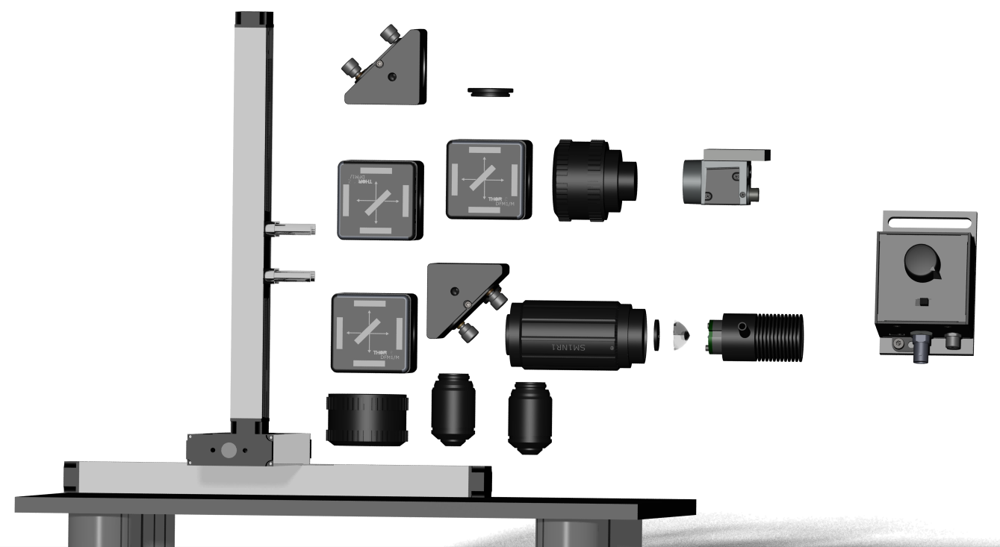
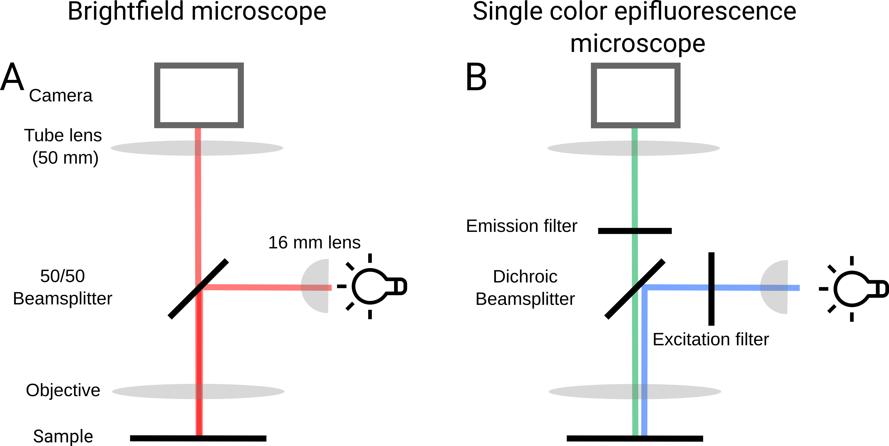
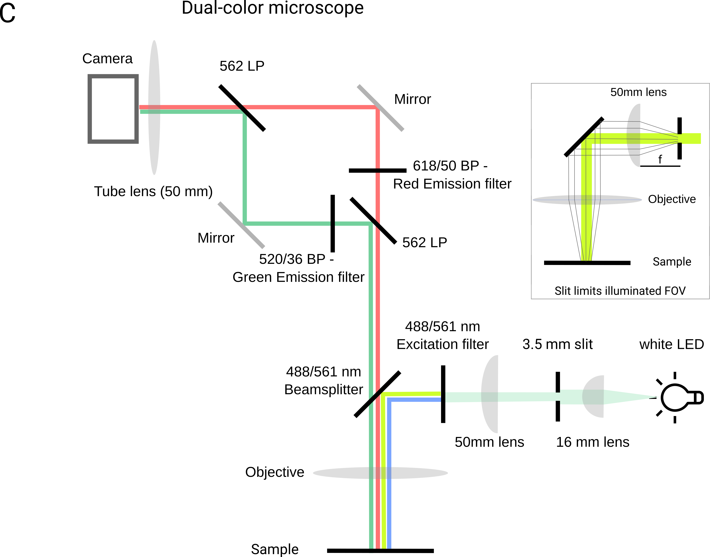

# Using the GlowTracker for education

| | |
|-|-|
|   | The modular microscope is very sitable for education. By building up the microscope from a simple Bright-field lightpath, a single-color epifluorescence microscope to the full dual-color version, students can learn key concepts in (fluorescence) microscopy. Building an epifluorescence microscope involves several fundamental concepts in optics, electronics, and biology. Here are key concepts that can be used to educate students in the process:  |

1. **Optics and Light Path:**

    

  

   - **Objective Lens:** Understanding the role of the objective lens in magnification and resolution is crucial. Testing different objectives and learning how to calculate the magnification of a objective-tube lens system.
     
   - **Excitation and Emission Filters:** Explain the principles behind selecting appropriate filters for excitation and emission wavelengths. This involves understanding the absorption and emission spectra of fluorophores.

  - **Image aberrations:** Students can experience image aberrations for example vignetting, chromatic aberration, ... and learn how to correct for these.

3. **Fluorescence:**
   - **Fluorophores:** Introduce the concept of fluorophores and how they absorb light at one wavelength and emit light at another. Discuss common fluorophores used in microscopy, such as GFP (Green Fluorescent Protein).
   - **Stokes Shift:** Teach students about the Stokes shift, which is the difference in wavelength between the absorbed and emitted light. Understanding this shift is critical for proper filter selection.
   - 

     

4. **Light Sources:**
   - **White or single-color LED Lamps:** Explain the advantages and disadvantages of different light sources. Mercury lamps provide a broad spectrum, while LEDs offer specific wavelengths.
   - **Collimation:** Emphasize the need for collimated light to ensure uniform illumination across the specimen.

5. **Image Formation and Detection:**
   - **CMOS Cameras:** Explain the use of CCD cameras for capturing fluorescence images. Discuss pixel resolution, sensitivity, and the relationship between exposure time and image quality.
   - **Image Processing:** Introduce basic image processing techniques required for tracking objects, such as contrast adjustment and background subtraction.

6. **Using genetically-encoded indicators as sensors:**
   - **Targeting fluorophores into specific tissues:** Discuss how expression can be achieved in different animals.
   - **Autofluorescence** Discuss naturally fluorescent materials (e.g., the planarian)
