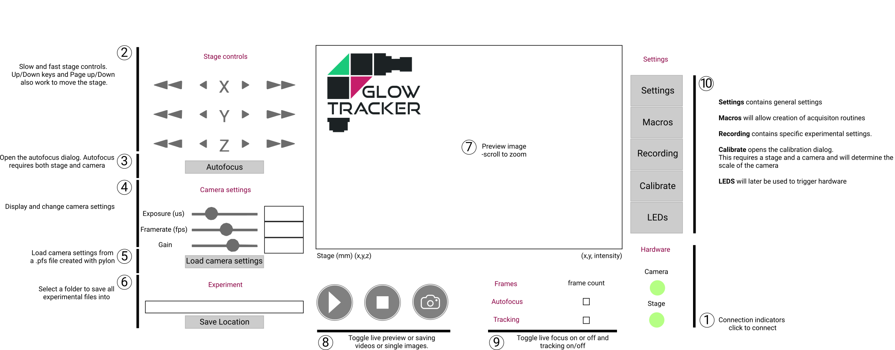
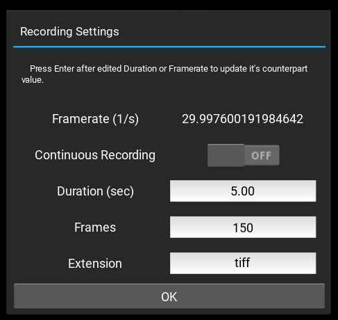
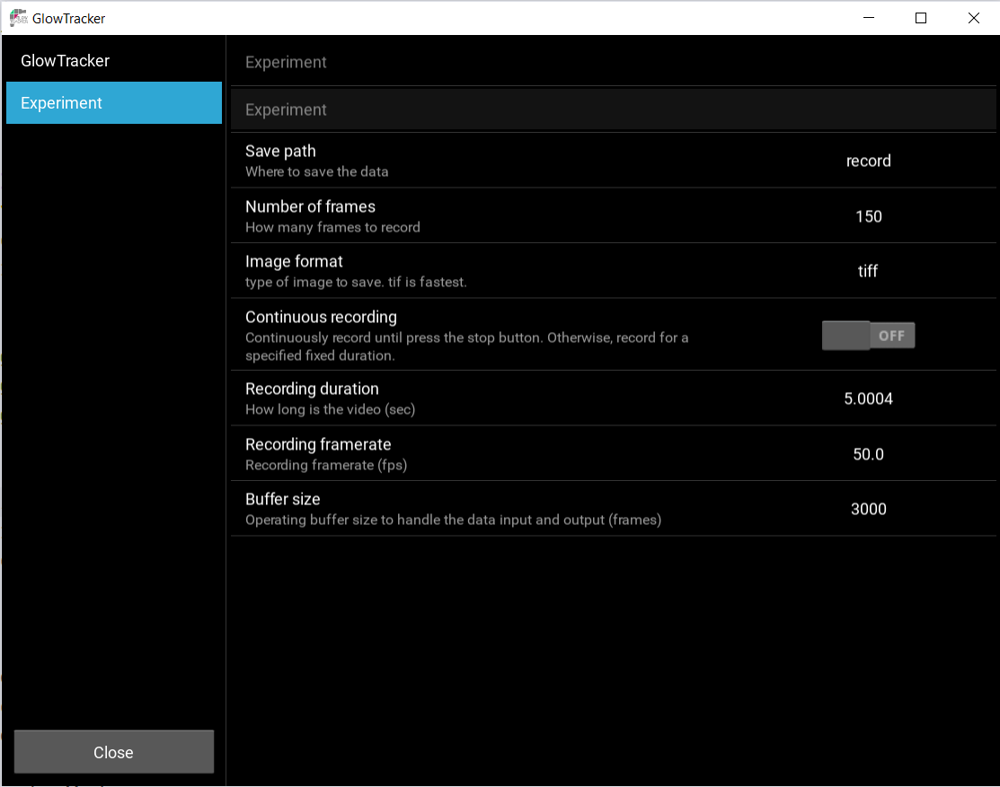
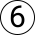

# Getting Started 
After you have finished constructing your microscope, connect the camera and stage's USBs to your computer.
1. [Opening up the GUI](#opening-the-gui) 
2. [Connect to the stage](#connect-to-the-stage)
3. [Connect to the camera](#connect-to-the-camera)
4. [Calibrate the camera and stage relationship](#calibrate-the-camera-and-stage-relationship) 
5. [Dual-color calibration (optional)](#dual-color-calibration) 
6. [Recording settings](#recording-settings) 

## Opening up the GUI <a name="opening-the-gui"></a>
<p align="center">
  
</p>


## Connect to the stage <a name="connect-to-the-stage"></a>
If you have never connected to the Zaber stage before, install and open [Zaber Launcher](https://software.zaber.com/zaber-launcher/download). 
In there, you can find the connection port name to your stage, usually `COM3` for Windows or `/dev/ttyUSB0` for Linux, and you can also update your stage firmware to the latest version. 
Afterward, close the Zaber Launcher and open up the GlowTracker. 
Open the **Settings** {: .inline-image} , put your connection port name in the section **Stage**, field **Stage serial port**. 
Close the settings, then click the **Stage** {: .inline-image}. If the button turns green then you have successfully connected the stage.

You can now control the stage movement by the stage control buttons ([GUI image](#gui-image): Group 2) or the arrow keys on your keyboard. The left ⇦, and right ⇨ keys control the stage X axis, ⇧ ⇩ control the stage Y axis, and Page Up, Page Down, raise and lower the stage. 
Press these in combination with the Shift key to move at a slower speed.

## Connect to the camera <a name="connect-to-the-camera"></a>
<p align="justify">
  If you have never connected to the Basler camera before, install and open the <a href="https://www.baslerweb.com/en/software/pylon/pylon-viewer/"><i>pylon Viewer</i></a>. In there, you can test the connection to your camera, specify your settings such as exposure time and gain, and then export your camera setting file as <b>.pfs</b>. 
  Open the <b>Settings</b> , put your connection port name in the section <b>Camera</b>, field <b>Default camera settings</b>.
  Close the settings, then click the <b>Camera</b> . If the button turns green then you have successfully connected the camera.
  You can view from the camera by pressing the live view button.
</p>


## Calibrate the camera and stage relationship <a name="calibrate-the-camera-and-stage-relationship"></a>
<p align="justify">
  Calibration is essential to translate the motion of the object of interest in the image to the compensatory motion of the stage, that centers the object.
</p>

1. <p align="justify">Select a sample that shows a lot of structure, for example, a ruler, or a drop of fluorescent pigment on a slide.</p>
    <table class="equal-column-table">
      <tr>
        <td>
          <figure class="center-figure">
            
            <figcaption>Fluorescent drop on a slide</figcaption>
          </figure>
        </td>
        <td>
          <figure class="center-figure">
            
            <figcaption>Placing the slide in the center of the objective</figcaption>
          </figure>
        </td>
      </tr>
    </table>
2. Open the **Calibrate** window {: .inline-image}. Navigate to the tab **Camera & Stage Calibration**.

3. <p align="justify"> Click <b>Calibrate</b>. The resulting pixel size and rotation of the camera will be shown, along with a plot display of the camera space and stage space.</p>
    <figure class="center-figure">
      
      <figcaption>Camera and Stage calibration result</figcaption>
    </figure>

4. <p align="justify">You can test if the calibration is correct by turning on the <b>Move in image space mode</b> option in the <b>Settings</b>  under <b>Stage</b> section. After turning it on, when you move the stage using the arrow keys <code>⇦</code><code>⇨</code><code>⇧</code><code>⇩</code>, the resulting image should also be moved accordingly and intuitively, e.g. pressing <code>⇧</code> should move the image up, and pressing <code>⇨</code> should also move the image to the right.</p>

<figure class="center-figure">
  
  <figcaption>Turn on the "Move in image space mode setting"</figcaption>
</figure>
   

## Dual-color calibration (optional) <a name="dual-color-calibration"></a>
(this step is only required in the dual-color configuration.)
To calibrate the relationship between the two color channels, which will later allow an accurate overlay of the two images, the image-splitter needs to be calibrated. 
1. Select a sample that shows either the same structure in both channels (e.g., fluorescent beads, fluorescent tape) or that has sufficient bleed-through to appear in both channels.
    <table class="equal-column-table">
      <tr>
        <td>
          <figure class="center-figure">
            
            <figcaption>Fluorescent stripes on a slide</figcaption>
          </figure>
        </td>
        <td>
          <figure class="center-figure">
            
            <figcaption>Placing the slide in the center of the objective</figcaption>
          </figure>
        </td>
      </tr>
    </table>

2. Open the calibration dialog by clicking on **Calibrate** {: .inline-image}. Navigate the tab to the section called **Dual Color Calibration**.

3. Click **Calibrate**. The calibration result will be shown in the overlay.
<figure class="center-figure">
  
  <figcaption>Dual-color calibration result</figcaption>
</figure>


## Recording settings <a name="recording-settings"></a>

Recording settings can be set quickly in the **Recording** {: .inline-image}, or in more details inside the **Settings** {: .inline-image} window, under the **Experiment** tab.

<figure class="center-figure">
  
  <figcaption>Recording settings widget</figcaption>
</figure>

The **Framerate (1/s)** refers to the camera's current frame rate as set and displays at {: .inline-image}.

<figure class="center-figure">
  
  <figcaption>Experiment settings</figcaption>
</figure>

The recording output location can be set by clicking the file dialo in {: .inline-image}, or in the **Settings** {: .inline-image}> **Experiment** > **Save Path**.
During a recording, a sequence of images and a recording log will be written to the directory.
The images are saved in `tiff` format by default, and can be optionally changed to `png` or `jpg`.
They are named in the following chronological convention `year-month-day-hour-minute-second-microsecond-basler_frame.tiff`, eg. 
```bash
2025-08-11-16-34-05-808215-basler_0.tiff
2025-08-11-16-34-05-808215-basler_1.tiff
...
```
The recording log with a similarly fahioned name `year-month-day-hour-minute-second-microsecond-coords.txt` containing data related to each recording are also saved with the following information:

```bash
# Recording
duration 5.0
nframes 242
# Camera
framerate 33.18290416777276
imageToStage -0.02024441584944725,-1.5099265575408936,1.5099265575408936,-0.02024441584944725
rotation -1.5842030734336334
imagenormaldir +Z
pixelsize 1.5100623217999616
# Dual color
dualcolormode False
mainside Right
viewmode Splitted
recordingmode Original
translation_x -6.5409646
translation_y 4.5999527
rotation -0.013371419154158244
# Tracking
roi_x 1800
roi_y 1800
capture_radius 400
min_step 1
threshold 30  
binning 4
dark_bg True
mode CMS
area 400
# Frame Time X Y Z minBrightness maxBrightness meanBrightness medianBrightness skewness percentile_5 percentile_95
0 252019.0 86.59006347656245 86.50721582031245 150.56420507812493 2 205 75.44840179037635 69.0 0.266955624255871 7.0 161.0 
1 252049.2 86.59006347656245 86.50721582031245 150.56420507812493 2 203 75.44819390262883 69.0 0.2669543748386637 7.0 161.0 
2 252079.3 86.59006347656245 86.50721582031245 150.56420507812493 2 203 75.44634974218782 69.0 0.2670122786962307 7.0 161.0 
3 252109.4 86.59006347656245 86.50721582031245 150.56420507812493 2 206 75.44769324617424 69.0 0.26691558590850634 7.0 161.0 
...
```
From the beginning section `# Recording` to `# Tracking` are meta data about that recordding session, and under the section `# Frame ...` contains the relevent data to each image frame.
Each column of the line `# Frame ...` writes it's respective header, i.e. first column is the image frame number (matching with the image file name), second column is the image time stamp (from the camera's internal clock), third is the camera position in X-axis (which can be directly interpret as the animal's position), and so on.

However, the image analysis data `minBrightness, maxBrightness, ..., percentile_95` will not be recorded by default because the computation tooks ~30ms per frame and may affect recording at high speed. The option can be enabled through **Settings** {: .inline-image} > **LiveAnalysis** > **Save to the recording**.