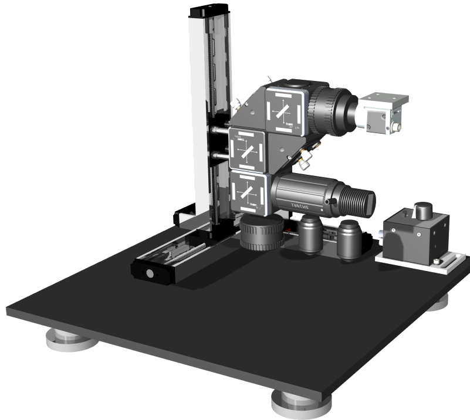

## GlowTracker
GlowTracker is a modular epifluorescence tracking microscope purely from commercially available **off-the-shelf components**, which **facilitates non-experts** to build. GlowTracker’s **affordability, versatility, and user-friendly** design make it a valuable addition to the toolkit of researchers studying small millimeter-scale organisms, offering novel capabilities for **fluorescence tracking**, all without the need for specialized fabrication. GlowTracker is specifically designed for sub-mm to mm-sized animals that are too small for standard videography and require microscopes for imaging.

    
    

### (Epifluorescence + Tracking) / affordable = GlowTracker
Epifluorescence microscopy uses fluorescence to visualize and study biological samples. Hereby, the sample has to be illuminated by a specific wavelength, which causes the sample to emit light of a higher wavelength. This light can then be captured by a camera. 
Developments in camera sensitivity and brightness of genetically-encoded indicators now allow for the tracking of animals, organs, or cellular structures and enable the study of sub-mm to mm large animals throughout space. This way a good visual resolution can be combined with an experimental arena that is bigger than the field of view of the camera. This can facilitate the study, for example, of behavior or cell activity in more detail, without limiting the sample to a narrow arena.

### Key properties of the GlowTracker
<table class="equal-column-table">
      <tr>
        <td>
           Maximal field-of-view (mm)
        </td>
        <td>
            7.4 x 4.95 (single)  
            3.7 x 4.95 (dual color)
        </td>
      </tr>
     <tr>
        <td>
           Maximal stage velocity (mm/s)
        </td>
        <td>
            65 
        </td>
      </tr>
     <tr>
        <td>
           Minimal pixel resolution (nm/px)
        </td>
        <td>
            585 nm (with Eo 12 mm objective)  
            471 (with Olympus 20x objective)
        </td>
      </tr>
    </table>

### Why is GlowTracker a great choice?
GlowTracker combines the advantages of epifluorescence imaging, with the advantages of tracking microscopy, to an affordable price. Moreover, we provide an easy to use [software](https://scholz-lab.github.io/GlowTracker/software/software.html) that allows researchers to record their experimental sample. Other solutions are often built for specific tasks and contain custom-built components or expensive hardware. Although GlowTracker is not limited to commercial parts, it can be built easily by non-experts. Because of its **modular design** GlowTracker enables researchers to build experimental setups, that are **easy** to build and use and fit the needs of the experiments. In later sections we provide a [detailed manual](https://scholz-lab.github.io/GlowTracker/build_your_own.html) and [comprehensive parts list](https://scholz-lab.github.io/GlowTracker/List%20of%20parts/List_of_parts.html) that you will need to build and perform the specific experiment. These designs range **from brightfield imaging to two-color imaging**, opening up broader applications. You can find exemplary use cases in our [publication]().

_Please cite: [Paper citation]()_
