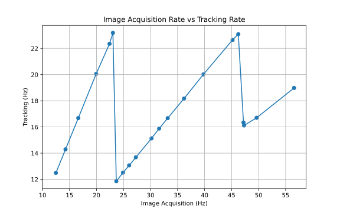
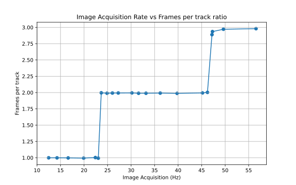

# Performance benchmark
The performance of GlowTracker can be separated into two parts: <b>Image Acquisition</b>, and <b>Tracking</b>.
Image acquisition is the process of acquiring images from the camera, until receiving a ready-to-use image in the host machine. 
Tracking is the process of computing the key point position in the image and moving the stage to the appropriate location.
The interactive widget below depicts the overall process and timeline, from image acquisition to tracking.

To determine the performance of the system, we are interested in two things: how fast we can acquire images (Hz), and how fast we can track the object in the image (Hz). 
Furthermore, we will calculate the ratio between the two to intuitively understand how much data is used for tracking versus skipped.

    <meta name=viewport content="width=device-width,initial-scale=1">  
    <meta charset="utf-8"/>
    
    

    

## Image acquisition
In an acquisition loop, the camera sensor receives a frame-start trigger signal, the sensor is exposed for a specified exposure time, then the sensor values are read out, internally processed in the camera, and sent to the host. After the host receives the image, it goes through an image processing pipeline one more time, then it is ready to be used in the application.

Many factors decide the acquisition rate. 
The most important factors that the user can control are exposure time, image size (or region-of-interest ROI), and binning mode. 
The exposure time determines how long the sensor is exposed to light before being read out. 
The shorter the exposure time, the higher the acquisition rate. 
The lower the image size, the higher the acquisition rate.
The binning mode, for example, if set to an additive mode, can increase the image brightness to compensate for the lower exposure time, but also reduce the effective image resolution.
Deciding these factors depends on the equipment setup and the animal that is going to be studied.
For more information on what are the parameters that affect the image acquisition rate, please visit <a href="https://docs.baslerweb.com/resulting-frame-rate"><i>Basler: Resulting frame rate</i></a>.

With all these affecting parameters in mind, the total time from beginning to receiving a frame-start trigger signal to having a useable image in the application is called a <i>one-frame time</i>, and it is noticeably longer than just the exposure time because it also contains the sensor readout time and image processing time.
Fortunately, we can operate the camera in a <a href="https://docs.baslerweb.com/electronic-shutter-types#rolling-shutter"><i>rolling shutter</i></a> mode, which exposes each row of the sensor consecutively with a small time offset (8 µs in our model) and also simultaneously read the row value out after it is finished. 
This significantly reduces the waiting time for the sensor readout and effectively increases the acquisition rate to almost equal the exposure time plus some constants.

The category of time that we will be using to benchmark is the effective image-receiving time, which is the timestamp at a point where the image is finished processing and is ready to be used in the application. The duration between each timestamp is essentially the <b>image acquisition rate</b>.

## Tracking
Once an image is received, the application calculates the location of interest and instructs the stage to move accordingly until the location of interest is at the center of the image. The application then waits for a new image to begin tracking once again.

The tracking algorithm is explained in <a href="#tracking"><i>Code explanation: Tracking</i></a>, and the amount of time to compute is denoted as <i>Compute Tracking</i> in the timeline widget above.
The time it takes to communicate to the stage and then wait until it is moved to the specified location is called <i>Communicate to Stage</i> and <i>Stage Moving</i> respectively. 
Additionally, we will have to wait for the camera to begin a new acquisition cycle.
This is because if we were to use the latest image that we have in the application, the image could be exposed during the stage movement, resulting in a motion blur. The position of the object may also be different, resulting in inaccurate tracking.
This amount of time depends on the tracking object, the camera, and the stage.
If the tracking objects move relatively fast in each frame, then the stage moving time increases.
If the image acquisition time is fast, then the waiting time for an acquisition cycle decreases.
If the stage movement speed profile is fast (depending on the hardware <a href="https://www.zaber.com/protocol-manual?protocol=ASCII#topic_setting_motion_accel_ramptime"><i>configuration</i></a>), then the waiting time for the stage to finish moving decreases.

The category of time that we will be using to benchmark is the effective image-tracking time, which is the time stamp at starting tracking of an image. The duration between each timestamp is the <b>tracking rate</b>.

## Benchmark
We benchmarked image acquisition and tracking rates using varying exposure times on a static fluorescent object for one minute at each acquisition rate. 
It is done on a static object rather than a moving animal to reduce variance.
This means that the results representes the performance at an ideal condition, and are most likely in actual usage.
Nevertheless, we believe that this would give the best insight on how the system perform.
By definition, the image acquisition rate is mainly an inverse of the exposure time with additional constant offsets.
We would like to know how fast our application can track with regard to image acquisition rate. 
The benchmarking is performed with image size of 1800 x 1800 pixels, no binning, in a laptop with 12th Gen Intel(R) Core(TM) i7-1255U 1.70 GHz CPU, 16 GB of RAM, and on a Windows 11 64-bit operating system. 
The results are shown in the plot below.

<figure class="center-figure">
    
</figure>

The above plot illustrates a seesaw pattern that seem counter intuitive at first.
As previously stated above, the tracking time consists of constant terms: computation time and communication time, and the inconstant terms: stage moving time and exposure-synchronization time.
At the beginning with 12.5 Hz image acquisition rate (equate to 80ms exposure time), we have tracking rate of 12.5 Hz.
As we increase the image acquisition rate (decrease exposure time) up until 23.1 Hz, the tracking rate increases proportionably at 1-to-1 ratio.
This is because we are able to track faster than we can acquire an image, and the tracking loop wait until a new image is acquired.

At the next acquisition rate 23.66 Hz, the tracking rate dropped from 23.19 Hz to 11.85 Hz, which is twice as slow.
This is because we are now acquiring images faster than we can track. So after we finished the tracking computation, we synchronize by waiting until the next frame.
The reason why we do not track on the next successive image frame in queue is because the camera sensor is most likely exposed while the stage is moving and the image could present motion-blur artifact. 
Tracking on these blurry images reduces accuracy, which makes the tracking jittery. 
Additionally, we can deduct that the constant tracking computation time is about 36ms.

Afterward, the trend resume as we increase the image acquisition rate, but now at a 2-to-1 ratio.

We can gain further intuitive understanding of how fast the application can track compare to how fast it can acquire images by dividing the image acquisition rate by the tracking rate. 
This gives us the ratio between the two, frames per track, telling how many frames have been acquired for the tracking of a frame to be completed. 
We then plot this ratio against the image acquisition rate in the plot below.

<figure class="center-figure">
    
</figure>

In this graph, we can see that the frame per track ratio changes in a step like fashion in a round number of image. 
Under the image acquisition rate of 23.1 Hz, we can track as fast as we can acquire an image.
From 23.1 Hz to 46.24 Hz, we skips one frame.
And above from 46.24 Hz, we skips two frames.

## Conclusion
The performance of the application depends on many variables, the hardware setup, the software, and the studied subject.
In our experience working with C. elegans and P. pacificus, using the described setup, we found that the range of exposure time to give a good quality image while still being relatively responsive is ranging from 20 ms to 60 ms.
Which yield the respective acquisition rates from 49.63 Hz to 16.63 Hz, and trackin rates from 16.7 Hz to 16.68 Hz, or the frame per track ratio of 3 to 1.