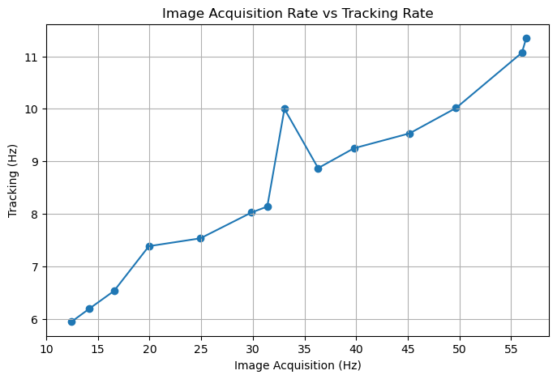

# Performance benchmark
The performance of GlowTracker can be separated into two parts: **Image Acquisition**, and **Tracking**.
Image acquisition is the process of acquiring images from the camera, until receiving a ready-to-use image in the host machine. 
Tracking is the process of computing the key point position in the image and moving the stage to the according location.
The interactive widget below depicts the overall process and timeline, from image acquisition to tracking.

In order to determine the performance of the system, we are interested in two things: how fast can we acquire images (Hz), and how fast can we track the object in the image (Hz). 
Additionally, we will also look at the ratio between the two, which will give an intuitive understanding of how much is the data is being used for tracking or skipped.

    <meta name=viewport content="width=device-width,initial-scale=1">  
    <meta charset="utf-8"/>
    
    

    

## Image acquisition
In an acquisition loop, the camera sensor receives a frame-start trigger signal, the sensor is exposed for a specified exposure time, then the sensor values are read out, internally processed in the camera, and sent to the host. After the host receives the image, it goes through an image processing pipeline one more time, then it is ready to be used in the application.

There are many factors that decide the acquisition rate. 
The most important factors that the user can control are exposure time, image size (or region-of-interest ROI), and binning mode. 
The exposure time determines how long the sensor is exposed to light before being read out. 
The shorter the exposure time, the higher the acquisition rate. 
The lower the image size, the higher the acquisition rate.
The binning mode, for example, if set to an additive mode, can increase the image brightness to compensate for the lower exposure time, but also reduce the effective image resolution.
Deciding these factors depends on the equipment setup and the animal that is going to be studied.
For more information on what are the parameters that affect the image acquisition rate, please visit [Basler: Resulting frame rate](https://docs.baslerweb.com/resulting-frame-rate)

With all these affecting parameters in mind, the total time from beginning to receiving a frame-start trigger signal to having a useable image in the application is called a *one-frame time*, and it is noticeably longer than just the exposure time because it also contains the sensor readout time and image processing time.
Fortunately, we can operate the camera in a [rolling shutter](https://docs.baslerweb.com/electronic-shutter-types#rolling-shutter) mode, which exposes each row of the sensor consecutively with a small time offset (8 µs in our model) and also simultaneously read the row value out after it is finished. 
This significantly reduces the waiting time for the sensor readout and effectively increases the acquisition rate to almost equal the exposure time plus some constants.

The category of time that we will be using to benchmark is the effective image-receiving time, which is the time stamp at a point where the image is finished processing and is ready to be used in the application. The duration between each time stamp is essentially the **image acquisition rate**.

## Tracking
After receiving an image, the application computes the location of interest, tells the stage to move respectively such that the location of interest will be at the center of the image, and then waits until receiving a new image to begin tracking again.

The tracking algorithm is explained in [Code explanation: Tracking](#tracking), and the amount of time to compute is denoted as *Compute Tracking* in the timeline widget above.
The amount of time takes to communicate to the stage and then wait until it is moved to the specified location is called *Communicate to Stage* and *Stage Moving* respectively. 
Additionally, we will have to wait for the camera to begin a new acquisition cycle.
This is because if we were to use the latest image that we have in the application, the image could be exposed during the stage movement, resulting in a motion blur. The object may also be in a different position, which when computed, could yield an incorrect tracking position.
This amount of time depends on the tracking object, the camera, and the stage.
If the tracking objects move relatively fast in each frame, then the stage moving time increases.
If the image acquisition time is fast, then the waiting time for an acquisition cycle decreases.
If the stage movement speed profile is fast (depending on the hardware [configuration](https://www.zaber.com/protocol-manual?protocol=ASCII#topic_setting_motion_accel_ramptime)), then the waiting time for the stage to finish moving decreases.

The category of time that we will be using to benchmark is the effective image-tracking time, which is the time stamp at starting tracking of an image. The duration between each time stamp is the **tracking rate**.

## Benchmark
We have performed benchmarking on the image acquisition rate and tracking rate with varying exposure times. 
By definition, the image acquisition rate is mainly an inverse of the exposure time with some constant factor. 
We would like to know how fast our application can track with regard to image acquisition rate. 
The benchmarking is performed with maximum image ROI (3088 x 2064 pixels), no binning, in a laptop with 12th Gen Intel(R) Core(TM) i7-1255U 1.70 GHz CPU, 16 GB of RAM, and on a Windows 10 64-bit operating system. The results is shown in the plot below.

<figure class="center-figure">
    
</figure>

Here we can observe that the relationship between the image acquisition rate and tracking rate is almost linearly proportional to each other. 
This makes sense as the faster we can acquire images, the faster we can track them. 
However, we notice that there is a spike in the tracking rate where the image acquisition rate is equal to 33.333 Hz, which is a result of setting the exposure time to 30 ms. 
We have yet to find a definitive answer to this. 
Our intuition for now is that there may be some acquisition rate that happens to synchronize perfectly with the tracking loop, which helps reduce the synchronization waiting time.

Additionally, we would like to have an intuitive understanding of how fast the application can track compared to how fast it can acquire images. 
We can do this by dividing the image acquisition rate by the tracking rate. 
This gives us the ratio between the two called **Frames per track**, depicting how many frames have been acquired for the tracking of a frame to be completed. 
We then plot this ratio against the image acquisition rate in the plot below.

<figure class="center-figure">
    
</figure>

From the above plot, a similar behavior as the previous plot can be observed. 
The frames-per-track ratio is mostly linearly proportionate to the image acquisition rate. 
This is because the compute-tracking time and communicate-to-stage time are independent of the image acquisition rate. 
Meaning no matter how fast we acquire images, we still have to wait for the same fixed amount of time to compute tracking, and so the frames-per-track ratio increases. 
The peak of tracking rate at 33.33 Hz image acquisition in the previous figure also now becomes a dip in this figure because it means that it has a higher tracking rate than its neighbors. 
The frames-per-track ratio has a lower bound of 2. 
This is because if the tracking scheme is so fast that it can be completed within an image acquisition cycle, it would still need to wait for a new acquisition cycle to receive a correct image to use for the next tracking.

## Conclusion
The performance of the application depends on many variables, the hardware setup, the software, and the studied subject.
In our experience working with C. elegans and P. pacificus, using the [described setup](), we found that the range of exposure time to give a good quality image while still being relative responsive is ranging from 20 ms to 60 ms, which yield the respective acquisition rates from 50 Hz to 16.67 Hz, and tracking rate from 11 Hz to 6.5 Hz, or the frames-per-track ratio of 5 to 2.5 times.