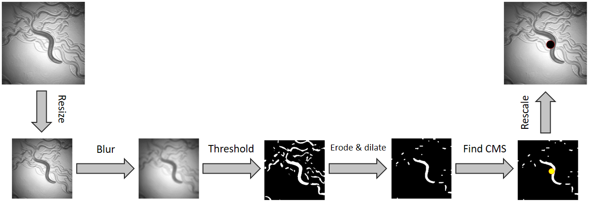
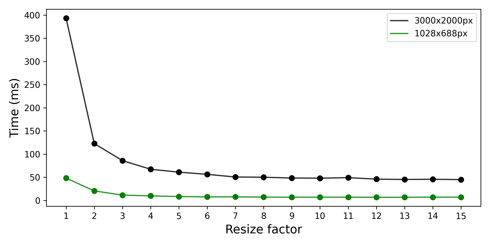
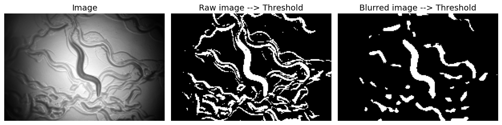
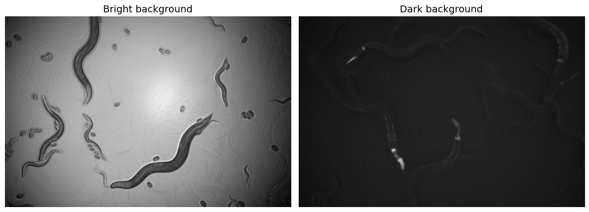
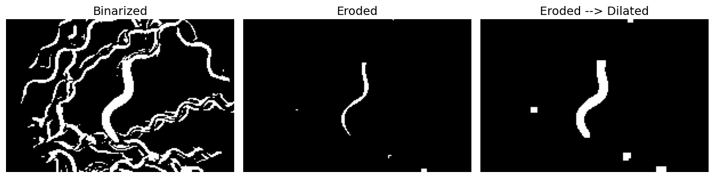
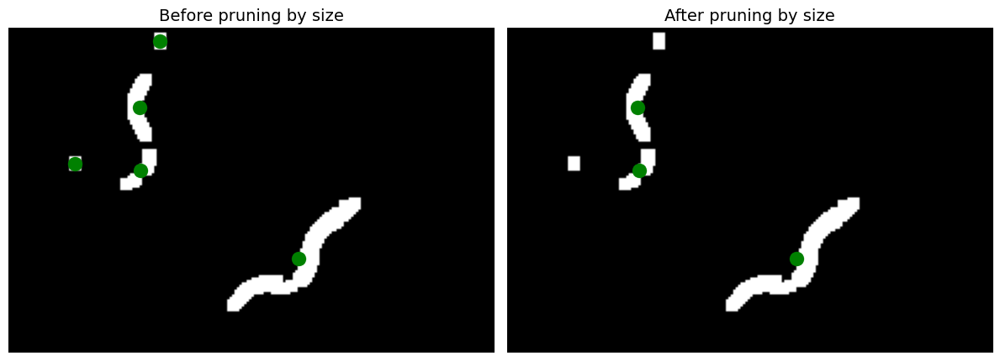
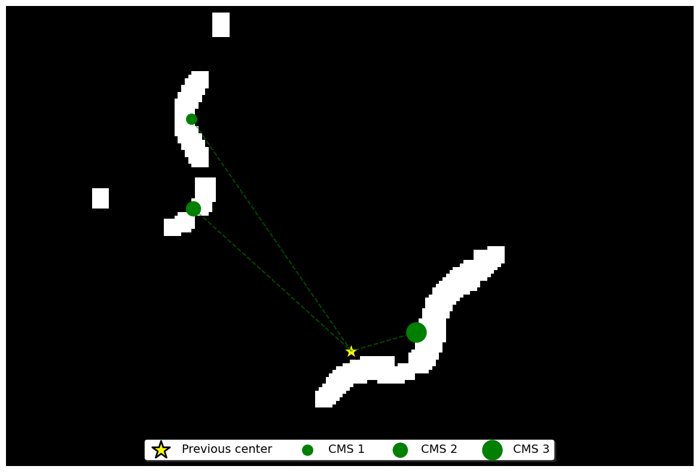

# Code Explanation

## Tracking

    To effectively track the worm, ensuring it remains centered in the image, we must adjust the stage to compensate for the worm's movement. This involves comparing the worm's current position with its previous one and using the disparity to relocate the stage accordingly.

<figure class="center-figure">
    
    <figcaption>Abstract representation of the implemented tracking algorithm</figcaption>
</figure>

### Resizing

    The initial step involves resizing the image to a smaller dimension, a crucial measure aimed at reducing computational load. This optimization significantly accelerates the tracking algorithm, enabling a higher frame rate. Depending on the resizing method employed —such as the <code>cv2.resize()</code> for a basic resizing technique— there might be a necessity to apply a blur to the image before resizing. This blurring process aims to mitigate the potential <i>aliasing effect</i> that could arise during downsampling. Further details on the aliasing effect can be found <a href="https://en.wikipedia.org/wiki/Aliasing">here</a>.

<figure class="center-figure">
    
    <figcaption>Comparing computational times while applying different resize factors to an image of dimensions 3000x2000 pixels</figcaption>
</figure>

### Blurring

    The next step involves applying a blur to the image. It makes the image appear smoother, which is a desirable effect as it reduces the noise in the image. More specifically, it reduces the high-frequency components of the image and preserves the low-frequency components. The blur is applied to the image using the <code>cv2.GaussianBlur()</code> function, which applies a <i>Gaussian kernel</i> to the image. The larger the kernel size, the more blur is applied to the image. 

<figure class="center-figure">
    
    <figcaption>Showing the impact of applying a blur filter before binarizing the image</figcaption>
</figure>

### Thresholding 

    In order to find the center of mass (CMS), it is required to work with a binary image - an image with only two possible values for each pixel. To do so, we apply a threshold to the image, which converts the image to a binary image. Simply said, the thresholding process involves converting the image to grayscale and then setting all pixels with a value above a certain threshold to white (foreground) and all pixels below the threshold to black (background). Depending on the type if recording, whether the background is dark and the worm is bright or vice versa, we apply a different thresholding method. We use the <code>skimage.filters.threshold_yen()</code> method and the <code>cv2.adaptiveThreshold()</code> method to apply the thresholding to the dark background and bright background recordings, respectively.

<figure class="center-figure">
    
    <figcaption>Bright vs. dark background images</figcaption>
</figure>

### Erosion & Dilation

    The next step involves applying an erosion and dilation filter to the image (). The erosion filter removes small white spots from the image, whereas the dilation filter fills in small holes in the image. By having erosion followed by dilation, we can remove small white spots while preserving the worm's shape. We can apply them for several iterations based on how much noisy is the image, hoe many objects are in the image, how close the objects are to each other, etc. However, having strict erosions and dilations can lead to the loss of the worm or merging of different objects into one. 

<figure class="center-figure">
    
    <figcaption>Impact of erosion and dilation</figcaption>
</figure>

### Finding the center of mass (CMS)

    The final step involves finding the center of mass (CMS) of the worm. By having a binary image, we can find the CMS locally for each white region (plausible worm) in the image. To do so we use the <code>skimage.measure.regionprops_table(&lt;BINARY_IMG&gt;, properties=('centroid', 'area'))</code> method, which returns the CMS and the area of each white region in the image. We then keep the top <i>K</i> regions with the largest area.

<figure class="center-figure">
    
    <figcaption>Keep the K largest regions (here K=3)</figcaption>
</figure>

    Then we compute the Euclidean distance (a.k.a. L2 norm) between the previous frame's CMS and the current frame's CMS for each region. Because of the high frame rate, the worm's movement between two consecutive frames is expected to be small. Therefore, we can assume that the region with the smallest distance is the worm. Please note that, using this approach, we are enable to track a worm even if there are multiple worms in the field of view.

<figure class="center-figure">
    
    <figcaption>Maintain and select the nearest centroid as a prediction of the worm's centroid.</figcaption>
</figure>

    Finally, we can use the CMS of the worm and compute the displacement between the CMS and the center of the image. This displacement is up-scaled and then used to move the stage accordingly. In other words, we move the stage such that the worm is centered in the image throughout the recording.

<figure class="center-figure">
    
    <figcaption>An example showing the performance of tracking</figcaption>
</figure>