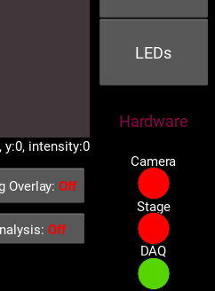
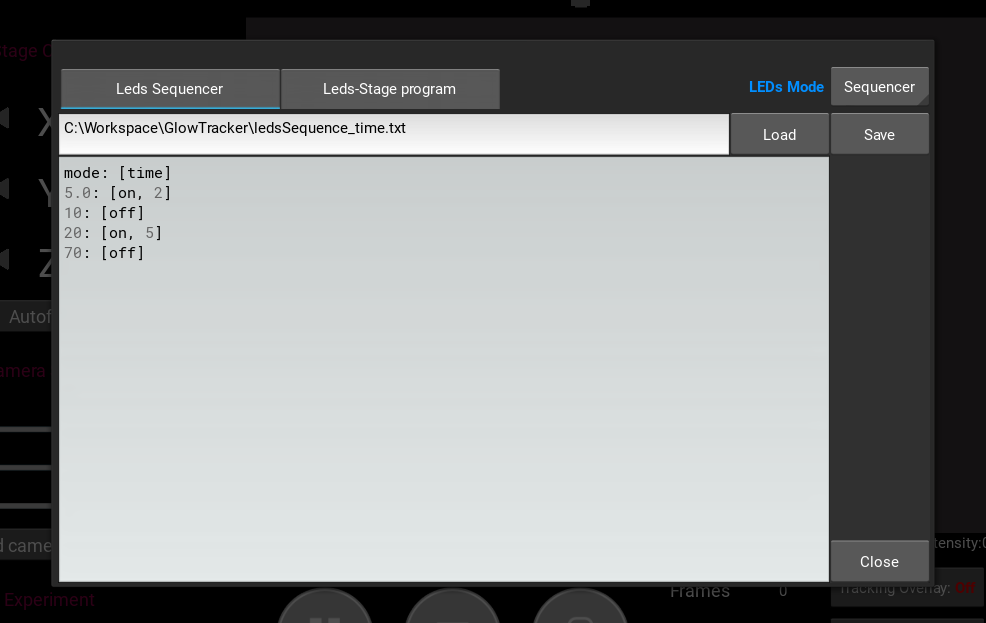
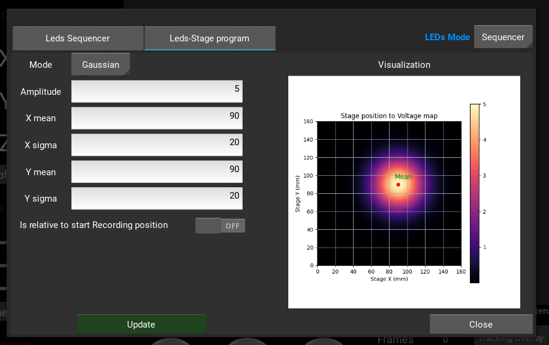

# DAQ Controller

GlowTracker has a feature that allows controlling of a Data Acquisition device (DAQ), specifically of LabJack U3 family, to send out analogue signal programatically to control other electronic devices such as an LED driver or a buzzer --- enabling a wide range of experimentation e.g. Mechanogenetics, and Optogenetics.
The analogue output line is set to `DAC0` (learn more [here](https://support.labjack.com/docs/2-hardware-description-u3-datasheet)) and the voltage is capped at 5V.

This feature can be accessed via the `LEDs` button on the right column.
A green light status under `DAQ` indicates a connection with a DAQ devices.
If the light status is red, click on it to attempt to connect to a DAQ device via USB port.

<figure class="center-figure">
  
</figure>

Once clicked, a window will appear.
There are two main tabs: **Leds Sequencer** and **Leds-Stage program**; each corresponds to how the analogue signal is sent.
**Leds Sequencer** lets you write a signal sequence, saying what time (second or frame number) and how much voltage.
**Leds-Stage program** lets you send out a signal based on current stage position.
To enable which mode activate when the recording start, click on the drop-down option next to the blue <b style='color:#018EFF;'>LEDs Mode</b> text, the options are: "Off", "Leds Sequencer", and "Leds-Stage program".

<figure class="center-figure">
  
  <figcaption>Sequencer GUI</figcaption>
</figure>


## Sequencer
The Sequencer lets you write a script that controls how much output voltage is send out at a given time (fractional second) or frame number, both starts at 0 from the beginning or recording.
Below are example scripts showing syntax.
Begin first line with either `mode: [frame]` or `mode: [time]`.
Then each following line starts with a number of frame, follow by a colon, and a bracket of a command of either `[on, {voltage}]` or `[off]`.
It is chronologically flexible but it would be better, mentally, to write in a chronological order.
When editing the script, write a desired file name in the text field above and press the **Save** button to save the content.
Otherwise, the content will be lost when the dialogue is closed.

### Frame
```
mode: [frame]
10: [on, 1.5]
20: [off]
200: [on, 1]
220: [on, 3.2]
400: [off]
```
This is an example script of sequencing the output signal by the number of recording frame. 
The output signal starts at zero (by default).
At the 10th frame, the output signal is changed to 1.5 vol and remain until frame 19th.
At the 20th frame, the output is set back to 0 vol and remain until frame 199th.
At the 200th frame, the output is changed to 1 vol and remain until frame 219th and so on.


### Time
```
mode: [time]
5.0: [on, 2]
10: [off]
20: [on, 5]
70: [off]
```
Here is an example script of sequencing the output signal by seconds since the start of recording.
The output signal starts at zero (by default).
At the 5th second, the output signal is changed to 2 vol and remain until before the 10th second.
At the 10th second, the output is set back to 0 vol and remain until before the 20th second and so on.

Depending on the camera's framerate, it is highly likely that we do not get an exact 1-to-1 match from the second to the acquired frame number.
In which case, the command will be mapped to the first closest frame after the specified ideal time e.g. if the target time is at 5.0 second but the acquired frames are at 4.9, 5.1, 5.3, ..., the command will execute at frame 5.1 second.

## Leds-Stage Program

<figure class="center-figure">
  
  <figcaption>StageProgram GUI</figcaption>
</figure>

Specify DAQ output voltage as a function of stage position.
There are two stage program modes: `Gaussian` and `FourPoint`.

- `Gaussian` is a normallized 2D Gaussian function $$\text{vol}=A \cdot\exp{\left(-\frac{(x - \mu_x)^2}{2 \sigma_x^2}-\frac{(y - \mu_y)^2}{2 \sigma_y^2}\right)}$$, where $$A$$ is an amplitude (peak of the distribution).

- `FourPoint` is bilinear interpolation between four 2D vertices $$\left[p_1, p_2, p_3, p_4 \right]$$, each with its weight $$\left[w_1, w_2, w_3, w_4 \right]$$. 
Points outside quadrilateral can be set to $$0$$ or a constant float value.

For both of the stage program modes, there is a toggle switch to interpret the parameters as relative to the starting position of the recording.

