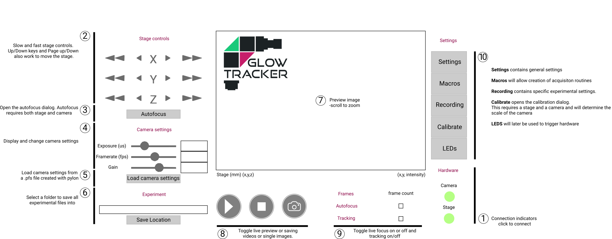

# Getting Started

After you have finished constructing your macroscope, connect the camera and stage's USBs to your computer.
1. [Opening up the GUI](#opening-the-gui) 
2. [Connect to the stage.](#connect-to-the-stage)
3. [Connect to the camera.](#connect-to-the-camera)
4. [Calibrate the camera and stage relationship.](#calibrate-the-camera-and-stage-relationship) 
5. [Dual-color calibration (optional).](#dual-color-calibration) 
6. [Set recording file path.](#set-recording-file-path) 

## Opening up the GUI 

  
  

TODO: Explain the GUI roughly in groups.

## Connect to the stage 
If you have never connected to the Zaber stage before, install and open [Zaber Launcher](https://software.zaber.com/zaber-launcher/download). 
In there you can find the connection port name to your stage, usually `COM3` for Windows or `/dev/ttyUSB0` for Linux, and you can also update your stage firmware to the latest version. 
Afterward, close the Zaber Launcher and open up the GlowTracker. 
Open the GUI setting , put your connection port name in the section `Stage`, field `Stage serial port`. 
Close the setting file and click the connect to stage button (TODO: point to the button), if the button turns green then you have successfully connected the stage.

You can now control the stage movement by the stage control buttons ([GUI image](#gui-image): Group 2) or the arrow keys on your keyboard. The left ⇦, right ⇨ keys control stage X axis, ⇧ ⇩ controls stage Y axis, and Page Up, Page Down, raises and lowers the stage. 
Press these in combination with the Shift key to move at a slower speed.

## Connect to the camera 
If you have never connected to the Basler camera before, install and open the [pylon Viewver](https://www.baslerweb.com/en/software/pylon/pylon-viewer/). In there you can test the connection to your camera, specifies your settings such as exposure time and gain, then export your camera setting file as `.pfs`. 
Open the GUI setting , put your connection port name in the section `Camera`, field `Default camera settings`.
Close the setting file and click the connect to camera button (TODO: point to the button), if the button turns green then you have successfully connected the camera.
You can view from the camera by pressing the live view button (TODO: link to button).

## Calibrate the camera and stage relationship 
Calibration is essential to translate motion of the object of interest in the image to the compensatory motion of the stage, that centers the object. To calibrate this relationship, open the calibrate

1. Select a sample that shows a lot of structure, for example a ruler or a grid. 
2. To open the calibration dialog, click on  Calibrate. Navigate the tab to the section called [TODO: Check name, add calibration screen shot]
3. Click 'Calibrate'. The resulting pixel size and rotation of the camera will be shown.
   
## Dual-color calibration (optional) 
(this step is only required in the dual-color configuration.)
To calibrate the relationship between the two color channels, which will later allow an accurate overlay of the two images, the image-splitter needs to be calibrated. 
1. Select a sample that shows either the same structure in both chanels (e.g., fluorescent beads, fluorescent tape) or that has sufficient bleed-through to appear in both channels.
2. To open the calibration dialog, click on  Calibrate. Navigate the tab to the section called [TODO: Check name, add calibration screen shot]
3. Click 'Calibrate'. The result will be shown as an overlay.
   
## Set recording file path 
To pick where your image files and recording data will be stored, select a location using the file dialog in . 
