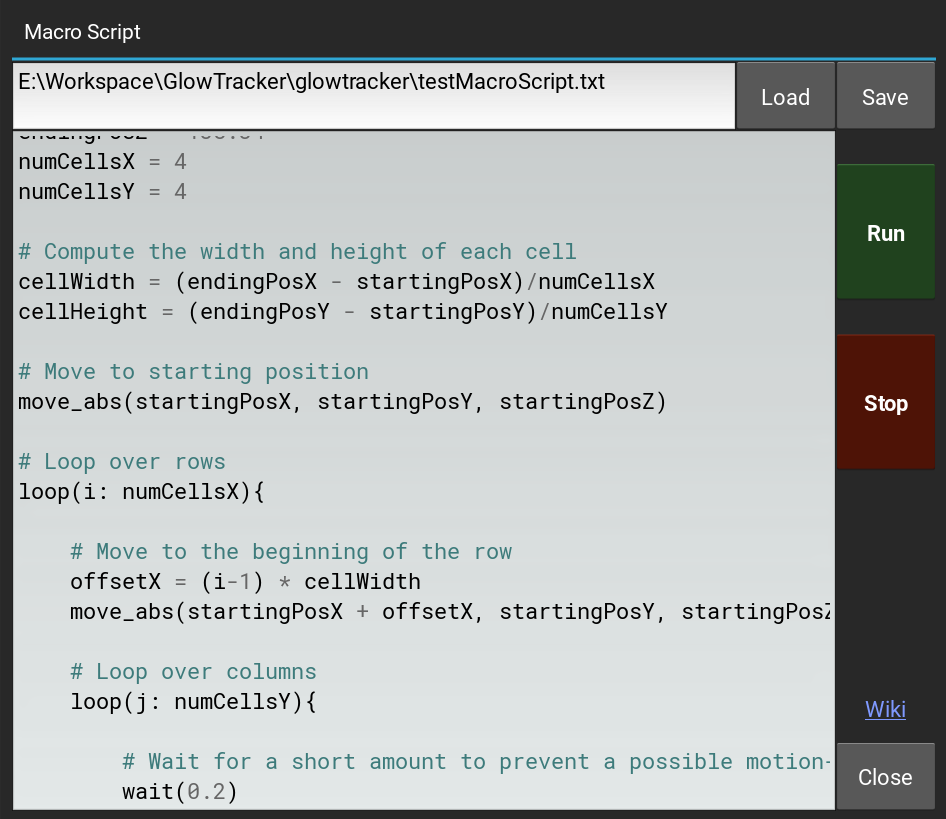

# Macro Script

The Macro Script feature allows the user to write a small, customized script to control the GlowTracker directly. 
This can help automatize some of the repetitive tasks that you may want to perform, such as moving the stage in a predefined pattern and taking images along the way. 
The Macro Script supports 7 predefined commands, a loop control, variable assignment, and simple arithmetic. 
The grammar is aimed to be simple and familiar just like a normal programming language. 
Users can start using the feature by opening the Macro Script window at **Settings > Macro**.

<figure class="center-figure">
  
  <figcaption>A Macro Script widget with an example script.</figcaption>
</figure>

## Types
- **int**: an integer e.g. `3`
- **float**: a floating point number with decimals e.g. `3.33`
- **number**: an integer or a floating point number
- **str**: a string surrounded by double quotes e.g. `"Hello World"`
- **var**: a variable name starts with an alphabet or an underscore, which can be assigned to a number or a another variable and combination of arithmetic
- **arithm**: an arithmetic operation of combination symbols: +, -, *, /, %, ()
- **command**: a predefined function listed below
- **statement**: a variable assignment, command, or flow control

## Grammar
### Variable assignment
A variable assignment is a command that assigns a value to a variable
. The syntax is as follows: `var = value`. Where `var` is the variable name, and `value` is of type `int`, `float`, `var`, or `arithm` e.g. `pos_X = 3`, `_pos_Y2 = pos_X * 2.4`

### Scope variable
A variable is defined at the scope they are in and can be accessed within the same scope or sub scopes, such as in a loop.

### Ignore whitespace
The space, tab, new line, and return characters are ignored. 
Theoretically statments can be written connected together without any whitespace in between and would still valid, as long as it is not ambiguous.
Although, not recommended.

### Comment
A comment starts with `#` and ends with the end of the line.


## Commands
Most of the commands will assume the current settings such as camera frame rate or file saving path to help make writing the script easier.
Users should adjust these values to their liking before running the script.

### `move_abs(x, y, z)`

Move the stage to a given absolute coordinate in millimeters (mm).

**Arguments**:

- `x` **number**: x coordinate
- `y` **number**: y coordinate
- `y` **number**: z coordinate

---

### `move_rel(x, y, z)`

Move the stage by a given relative amount in millimeters (mm).

**Arguments**:

- `x` **number**: x axis relative amount
- `y` **number**: y axis relative amount
- `y` **number**: z axis relative amount

---

### `snap()`

Take an image and save into the path specified in the lowert-left corner of the GlowTracker main window or in **Settings> Experiments> Save Path**.

**Arguments**:

- None

---

### `record_for(duration)`

Start recoding for the given duration in seconds. 
Automatically stop recording after the duration is reached.
The images are saved into the path specified in the lowert-left corner of the GlowTracker main window or in **Settings> Experiments> Save Path**.

The function is asynchronous, which means other commands such as moving the stage could be executed during the recording simultaneously. 

If the camera is already in a recording mode, the function will try to stop the previous recording first, and then start a new recording. 
However, it could still fail to do so due to a race condition and crashed. 
Thus, it is recommended to stop and wait a short duration between a quick succession of recording commands.

**Arguments**:

- `duration` **number**: recording duration in seconds

---

### `start_recording()`

Start the camera recording. 

The images are saved into the path specified in the lowert-left corner of the GlowTracker main window or in **Settings> Experiments> Save Path**.

The function is asynchronous, which means other commands such as moving the stage could be executed during the recording simultaneously. 

If the camera is already in a recording mode, the function will try to stop the previous recording first, and then start a new recording. However, it could still fail to do so due to a race condition and crashed. Thus, it is recommended to stop and wait a short duration between a quick succession of recording commands.

**Arguments**:

- None

---

### `stop_recording()`

Stop the camera recording.

**Arguments**:

- None

---

### `wait(duration)`

Wait for the given duration in seconds.

**Arguments**:

- `wait` **number**: duration in seconds

---

### `print(message, ...)`

Print the messages to the terminal.
A message can be a string or a number.
Multiple messages can be printed together by separating them with commas e.g. `print("Taking image", i)`.

**Arguments**:

- `message` **str** \| **number**: duration in seconds

## Flow Control

### ```loop(iterator : times){ statement, ... }```

Execute a given list of statement inside the curly brackets `{ ... }` for a given, fixed number of times.
The `iterator` argument is a new variable that can be used inside the loop scope as a normal variable. Although the variable is writeable, it's value will be overwritten at each iteration.

**Arguments**:

- `iterator` **str**: the name of a new iterator that will be used to count the looping, starting from 0.
- `times` **int**: number of times to loop

## Example
```python
# 
# An example script of how to do a scan recording in a grid fashion.
# 
# Define variables
startingPosX = 46.35
startingPosY = 76.61
startingPosZ = 138.34
endingPosX = 47.01
endingPosY = 75.41
endingPosZ = 138.34
numCellsX = 4
numCellsY = 4

# Compute the width and height of each cell
cellWidth = (endingPosX - startingPosX)/numCellsX
cellHeight = (endingPosY - startingPosY)/numCellsY

# Move to starting position
move_abs(startingPosX, startingPosY, startingPosZ)

# Loop over rows
loop(i: numCellsX){

    # Move to the beginning of the row
    offsetX = (i-1) * cellWidth
    move_abs(startingPosX + offsetX, startingPosY, startingPosZ)
    
    # Loop over columns
    loop(j: numCellsY){

        # Wait for a short amount to prevent a possible motion-blurred image
        wait(0.2)
        # Take an image
        snap()
		
        # Or record a short clip
        # record_for(1)
        # wait(1)
        
        # Move relative down the Y axis
        move_rel(0, cellHeight, 0)
    }
}
```